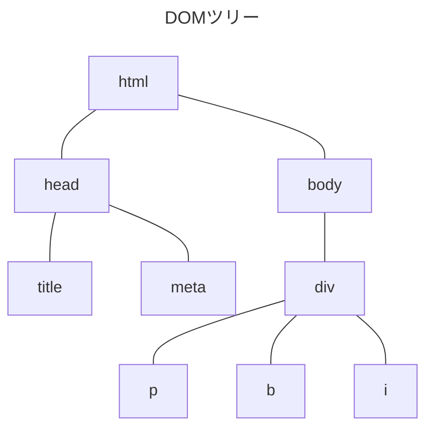
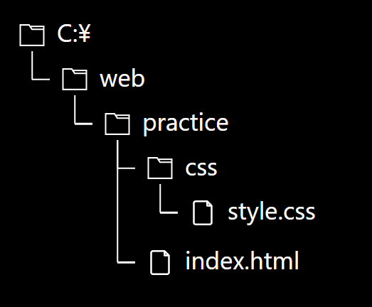
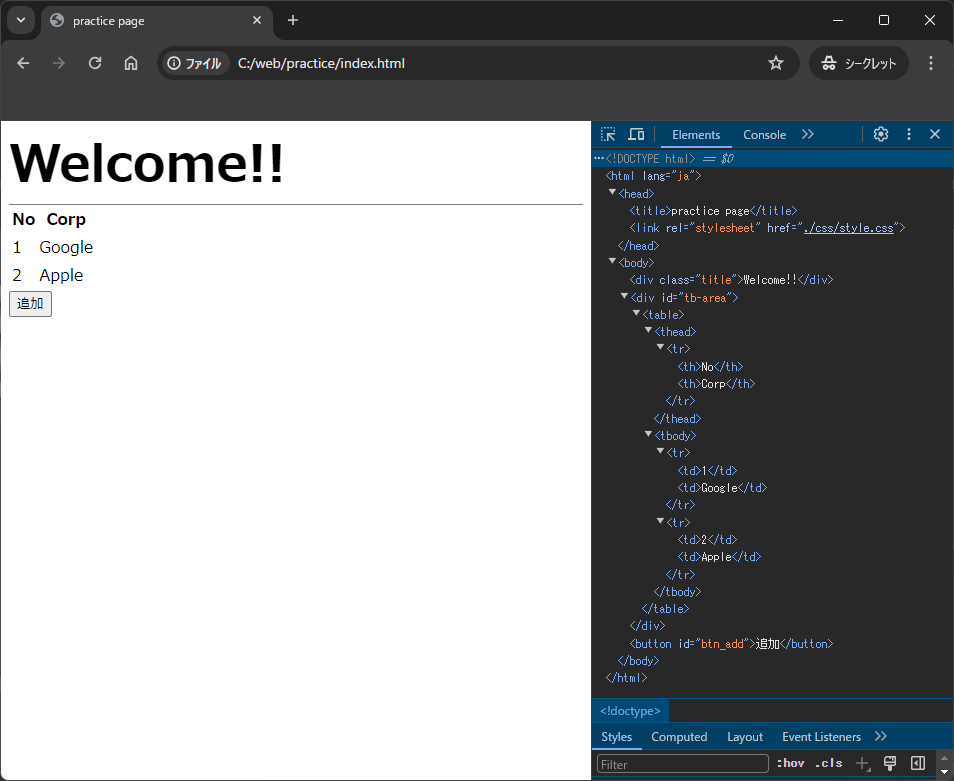

# DOMについて
WebページはHTMLとCSSで構成されています  
ブラウザは、Webページを表示する際にそれらを __DOM(Document Object Model)__ へと変換します  

JavaScriptでは、このDOMを操作することで前述のようにWebページを変化させることができます  

## DOMの構造
DOMはHTMLをツリー(木)構造で表現したものになっています  
この構造のことを __DOMツリー__ と呼びます  
また、DOMツリーを構成している各要素のことを、 __ノード__ と呼びます  
ノードはHTML上でいうところのタグにあたります  

```html title="HTML"
<!DOCTYPE html>
<html lang="ja">
    <head>
        <title>practice page</title>
        <meta charset="UTF-8">
    </head>

    <body>
        <div>
            <p>Welcome!!</p>
            <b>ようこそ!!</b>
            <i>Benvenuto!!</i>
        </div>
    </body>
</html>
```

例えば、上記のようなHTMLの場合、DOMツリーは以下になります  



## DOMの確認①
DOMは、ブラウザに搭載されている __開発者ツール__ を利用することで実際に確認することができます  
DOMを確認するための環境を準備をしましょう  
以下の手順に従ってWebページを作成します  

<details>
<summary>Webページ 作成手順</summary>

1. 作業用フォルダ「C:\web\practice」を新規作成します  
中間のフォルダが存在しない場合は、同様に新規作成してください

2. 「practice」フォルダに以下のファイルを作成しましょう

```html title="index.html"
<!DOCTYPE html>
<html lang="ja">
    <head>
        <title>practice page</title>
        <link rel="stylesheet" href="./css/style.css">
    </head>

    <body>
        <div class="title">Welcome!!</div>

        <div>
            <table>
                <thead>
                    <th>No</th>
                    <th>Corp</th>
                </thead>
                <tbody id="tb-body">
                    <tr>
                        <td>1</td>
                        <td>Google</td>
                    </tr>
                    <tr>
                        <td>2</td>
                        <td>Apple</td>
                    </tr>
                </tbody>
            </table>
        </div>
        <button id='btn-add'>追加</button>
    </body>
</html>
```

3. 「practice」フォルダに「css」フォルダを新規作成します

4. 「css」フォルダ( 「C:\web\practice\css」 )へ以下のファイルを作成しましょう
```css title="style.css"
.title{
    font-weight: bold;
    font-size: 50px;
    color: black;
    border-bottom: solid 1px;
    border-color: gray;
}
```  

5. フォルダ構造は以下の通りになります  

</details>

## DOMの確認②

作成したWebページのDOMを実際に確認してみましょう  

### 確認手順
1. 作成した「index.html」をブラウザで開きます  

2. 「F12」キーを押して __開発者ツール__ を表示します  
:::tip
ChromeやEdgeといったブラウザでは、「F12」キーを押すことで __開発者ツール__ が開きます  
開発者ツールでは、現在開いているWebページのDOM確認や、作成したHTMLやCSSのデバッグを行うことができます  
とても有用なツールなので、Webページを開発する際は活用していきましょう

開発者ツールの利用方法は以下のリファレンスを参考にしましょう  
[ブラウザーの開発者ツールとは](https://developer.mozilla.org/ja/docs/Learn/Common_questions/Tools_and_setup/What_are_browser_developer_tools)
:::


3. [Elements]タブ(もしくは[要素]タブ)を選択することで、「index.html」のDOMを確認できます  
