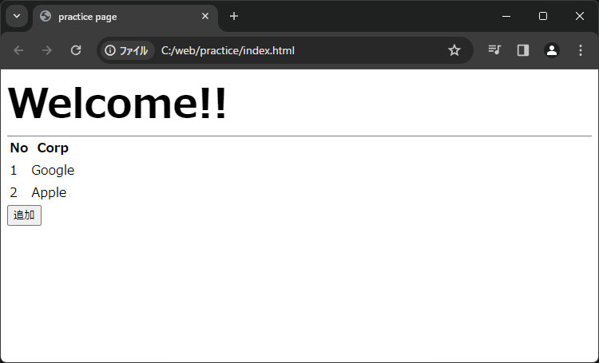
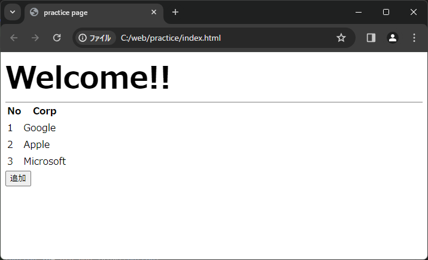

# DOM操作
DOMについて学習できたところで、JavaScriptを実際に動作させてみましょう

## 準備

### jsファイルの作成
JavaScriptはjsファイルと呼ばれる、「.js」のファイルへ記述します  
作業用フォルダ「C:\web\practice」へ「js」フォルダを作成してください  
その後、「js」フォルダへ以下のファイルを新規作成・記述しましょう
```js title="script.js" showLineNumbers
// イベント「Webページの読み込み」のイベントリスナーを設定
// イベント発生時はloadEvent関数を実行
window.addEventListener('load', loadEvent);

// loadEvent関数
function loadEvent(){
    // id属性が「btn_add」となっているノードを取得
    const button = document.getElementById('btn-add');
    // ノードをクリックした時に、「btnAddClick」関数を呼び出すイベントを設定する
    button.setAttribute('onclick', 'btnAddClick()');
}

// 「追加」ボタンをクリックしたときのイベント
function btnAddClick(){
    // id属性が「tb-body」となっているノードを取得
    const tbBody = document.getElementById('tb-body');
    // trのノードを新規作成
    const tr = document.createElement('tr');

    // tdのノードを新規作成
    const tdNo = document.createElement('td');    // No列
    const tdCorp = document.createElement('td');  // Corp列

    // tdの内容を設定
    tdNo.textContent = '3';
    tdCorp.textContent = 'Microsoft';

    // trに子ノードとして、tdを追加
    tr.appendChild(tdNo);
    tr.appendChild(tdCorp);
    // tbBodyに子ノードとして、trを追加
    tbBody.appendChild(tr);
}
```

### jsファイルの読み込み
作成した「js」ファイルは、そのままでは実行されません  
CSSと同様に、HTMLファイルへ読み込み処理を記述する必要があります  
読み込み処理は以下のように記述します  
```html title=index.html
<script src="{jsファイルのパス}"></script>
```

今回の場合は以下を「index.html」のheadタグ内に追記しましょう  
```html title=index.html
<script src="./js/script.js"></script>
```

## JavaScirptの実行
では、実際にJavaScriptを実行してみましょう  

1. 「index.html」を再びブラウザで開きます  
既に開いている場合は、Webページを「F5」キーで更新しましょう



2. 「追加」ボタンをクリックします  
JavaScriptによってテーブルのDOMが操作され、行が1行追加されます  



## コード解説
では、上記で実行したサンプルコードの内容を順番に解説していきます。

### 1. イベントとイベントリスナー
サンプルコードではまず、イベントリスナーの登録を行っています  

#### 【イベント】

JavaScriptでは、ユーザーの操作などによってブラウザ上で発生するアクションのことを「__イベント__」と呼びます  
例えば、ユーザーによるWebページの読み込み(ロード)・マウスのクリック・キーボードの入力といったものがこの __イベント__ にあたります  

#### 【イベントリスナー】

特定イベントを監視し、そのイベントが発生した場合に予め指定した処理を行う仕組みを __イベントリスナー__ と呼びます  
イベントリスナーを設定し有効化することを、一般的に「イベントリスナーを登録する」と言います  

サンプルコードでは、Webページ(window)で発生するイベント「Webページの読み込み」(以下、loadイベント)のイベントリスナーを登録しています  
イベントが発生した場合、loadEvent関数が実行されます  

```js title="イベントリスナーを登録" showLineNumbers
// イベント「Webページの読み込み」のイベントリスナーを設定
// イベント発生時はloadEvent関数を実行
window.addEventListener('load', loadEvent);
```  

イベントとイベントリスナーの詳細ついては以下のリファレンスも参考にしてください  
- [イベントの扱い - MDN](https://developer.mozilla.org/ja/docs/Web/Events/Event_handlers)  
- [イベント入門 - MDN](https://developer.mozilla.org/ja/docs/Learn/JavaScript/Building_blocks/Events)


### 2. 関数
上述のとおり、loadイベントが発生した時loadEvent関数が実行されます  

```js title="loadEvent関数" showLineNumbers
// loadEvent関数
function loadEvent(){
    // id属性が「btn_add」となっているノードを取得
    const button = document.getElementById('btn-add');
    // ノードをクリックした時に、「btnAddClick」関数を呼び出すイベントを設定する
    button.addEventListener('click', btnAddClick);
}
```

#### 【通常の関数定義】

通常、関数は以下のように定義し実行することができます  
```js title="関数の定義" showLineNumbers
function 関数名(引数){
    /* ここに関数の処理 */
    return 戻り値
}

// 関数の実行
関数名(引数);
```

#### 【関数式】
特殊な定義方法として __関数式__ があります  
関数式は通常の関数定義と違い、変数に代入する形で関数を定義します  
変数を呼び出すことで、関数を実行することができます  

関数式には主に以下の記述法があります
- 無名関数
```js title="関数式" showLineNumbers
const 変数名 = function (引数) {
    /* ここに関数の処理 */
    return 戻り値
};

// 関数を実行する
変数名(引数);
```

- アロー関数
```js title="関数の定義" showLineNumbers
const 変数名 = (引数) => {
    /* ここに関数の処理 */
    return 戻り値
};

// 関数を実行する
変数名(引数);
```

どの関数定義を使用するかは、書き手によって様々です  
- 自分で読みやすい  
- 他人が読みやすいであろう  

以上を基本に、その時に最善と思われる定義方法を選択しましょう  

:::caution
関数式を扱う場合に注意すべき点があります  
以下も一読しておきましょう
<details>
<summary>関数定義の位置について</summary>

通常の関数は、呼び出しを行う位置を気にする必要がありません  
例えば、関数定義の前に呼び出しを行っても正常に関数は実行されます  
```js title="通常の関数: 定義の前で呼び出し" showLineNumbers
// 関数定義の前で関数の呼び出し
console.log(example(10, 20));

// exmaple関数を定義
function example(a, b){
    // 戻り値を設定
    return a + b;
}
```
> 出力: 30  

```js title="通常の関数: 定義の後で呼び出し" showLineNumbers
// exmaple関数を定義
function example(a, b){
    // 戻り値を設定
    return a + b;
}

// 関数定義の後で関数の呼び出し
console.log(example(10, 20));
```
> 出力: 30  
---
それに対し関数式は、 __関数定義の後のみ__ 呼び出しを行うことができます  
関数式を利用する際は、呼び出しを行う位置に注意しましょう  

```js title="関数式: 定義の前で呼び出し" showLineNumbers
// 関数定義の前で関数の呼び出し
console.log(example(10, 20));

// exmaple変数に関数式を代入
const example = function (a, b) {
    return a + b;
};
```
> 出力: エラー(ReferenceError: Cannot access 'example' before initialization)  

```js title="関数式: 定義の後で呼び出し" showLineNumbers
// exmaple変数に関数式を代入
const example = function (a, b) {
    return a + b;
};

// 関数定義の後で関数の呼び出し
console.log(example(10, 20));
```
> 出力: 30  
</details>
:::

その他、詳細については以下のリファレンスを参考にしてください
- [関数 - MDN](https://developer.mozilla.org/ja/docs/Web/JavaScript/Guide/Functions)  
- [関数式 - MDN](https://developer.mozilla.org/ja/docs/Web/JavaScript/Reference/Operators/function)
- [アロー関数 - MDN](https://developer.mozilla.org/ja/docs/Web/JavaScript/Reference/Functions/Arrow_functions)

### 3. ノードの取得
loadEvent関数内では、以下の処理を記述しています  
1. 'btn-add'というid属性を持つノードを取得  
2. 対象ノードで発生するイベント「マウスクリック」のイベントリスナーを登録  

```js title="loadEvent関数" showLineNumbers
// loadEvent関数
function loadEvent(){
    // id属性が「btn_add」となっているノードを取得
    const button = document.getElementById('btn-add');
    // ノードをクリックした時に、「btnAddClick」関数を呼び出すイベントを設定する
    button.addEventListener('click', btnAddClick);
}
```

ノードの取得を行うことで、目的のノードをオブジェクトとして取得することができます  

今回の場合、取得されているのはbuttonノードです  
index.htmlを見ると、id属性に'btn-add'が指定されています  
```html title="index.html"
<button id='btn-add'>追加</button>
```

#### ノード取得処理の種類
ノード取得処理には複数の種類があります  
今回の場合はノードの __id属性__ をキーに目的のノードを取得しています

```js title="id属性をキーにしたノード取得"
document.getElementById('ここにid属性の値')
```

その他の種類については、以下の通りです  
各リファレンスも参考にしてください  
| 取得処理 | キー |
|:----:|:----:|
| [document.getElementById](https://developer.mozilla.org/ja/docs/Web/API/Document/getElementById) | id属性 |
| [document.getElementsByClassName](https://developer.mozilla.org/ja/docs/Web/API/Document/getElementById) | class属性 |
| [document.getElementsByName](https://developer.mozilla.org/ja/docs/Web/API/Document/getElementById) | name属性 |
| [getElementsByTagName](https://developer.mozilla.org/ja/docs/Web/API/Document/getElementById) | タグ名 |


#### 変数と定数
今回、取得したノードオブジェクトを定数へ代入しています  
```js title="取得したノードをbutton定数へ代入"
const button = document.getElementById('btn-add');
```

JavaScriptでは、定数および変数を以下の様に宣言できます  

```js title="定数: const"
const 定数名 = 代入するオブジェクトや式;
```

```js title="変数: let"
let 変数名 = 代入するオブジェクトや式;
```

:::tip
変数と定数は宣言の方法は似ていますが明確な違いがあります  
定数は、宣言した後に再度値を変更することができません  

| 処理 | 値の変更 |
|:----:|:----:|
| const | × |
| let | ○ |

一度宣言し、その後は値を変更しないデータについては  
無用な変更やバグを回避するため、基本的に定数で宣言するように心がけましょう  

詳細については以下のリファレンスも参考にしてください
- (Constant (定数) - MDN)[https://developer.mozilla.org/ja/docs/Glossary/Constant]
- (const - MDN)[https://developer.mozilla.org/ja/docs/Web/JavaScript/Reference/Statements/const]
- (必要な情報を保管する — 変数 - MDN)[https://developer.mozilla.org/ja/docs/Learn/JavaScript/First_steps/Variables]
- (let - MDN)[https://developer.mozilla.org/ja/docs/Web/JavaScript/Reference/Statements/let]
:::

### 4. ノードの作成
ここまでで、Webページ上の「追加」ボタンをクリックした時に、btnAddClick関数を実行することができます  

btnAddClick関数では、以下の処理を記述しています
1. 'tb-body'というid属性を持つ、tbodyノードを取得  
2. trノード、tdノードを新規作成  
3. tdノードに表示する内容を設定  
5. trノードの子ノードとして、tdノードを設定  
6. tbodyノードの子ノードとして、trノードを設定  

``` js title="btnAddClick関数" showLineNumbers
// 「追加」ボタンをクリックしたときのイベント
function btnAddClick(){
    // id属性が「tb-body」となっているノードを取得
    const tbBody = document.getElementById('tb-body');
    // trのノードを新規作成
    const tr = document.createElement('tr');

    // tdのノードを新規作成
    const tdNo = document.createElement('td');    // No列
    const tdCorp = document.createElement('td');  // Corp列

    // tdの内容を設定
    tdNo.textContent = '3';
    tdCorp.textContent = 'Microsoft';

    // trに子ノードとして、tdを追加
    tr.appendChild(tdNo);
    tr.appendChild(tdCorp);
    // tbBodyに子ノードとして、trを追加
    tbBody.appendChild(tr);
}
```

#### ノード作成
JavaScriptではノードの取得が可能なように、ノードを新規作成することができます  
今回は、テーブルへ新規の行を追加するために、trノードとtdノードをそれぞれ新規作成しています  

```js title="ノード作成" showLineNumbers
// trのノードを新規作成
const tr = document.createElement('tr');

// tdのノードを新規作成
const tdNo = document.createElement('td');    // No列
const tdCorp = document.createElement('td');  // Corp列
```

ノードの新規作成処理は以下のように記述します  
```js title="ノード作成"
document.createElement('ここにノード名')
```

新規作成されたノードはHTMLに直すと以下のようなイメージです  
まだ、何も設定されていない空のノードとなっています  
```html title="htmlイメージ" showLineNumbers
<!-- No列 -->
<td></td>
<!-- Corp列 -->
<td></td>
```

### 5. ノードの設定
新規作成したばかりの空ノードをテーブルへ追加していくために、ノードの設定を行う必要があります  
今回は2つのtdノードにそれぞれ、「3」と「Microsoft」という文字列を表示するため、 ノードの __textContent__ プロパティを設定しています  

```js title="ノード作成" showLineNumbers
// tdの内容を設定
tdNo.textContent = '3';
tdCorp.textContent = 'Microsoft';
```

上記設定がされたとき、HTMLに直すと以下のようなイメージになります
```html title="htmlイメージ" showLineNumbers
<!-- No列 -->
<td>3</td>
<!-- Corp列 -->
<td>Microsoft</td>
```

#### ノードの親子関係を設定①
HTML上のテーブルの記述方法ではtd要素はtr要素の子要素である必要があります  
ノードにおいても同様になるため、trノードとtdノードの親子関係を設定します  

```js title="ノードの親子関係設定①" showLineNumbers
// trに子ノードとして、tdを追加
tr.appendChild(tdNo);
tr.appendChild(tdCorp);
```

上記では、trノードの __appendChild__ メソッドを実行し、tdノードをそれぞれ子ノードとして設定しています  

HTMLに直すと以下のようなイメージへ設定することができます  
```html title="htmlイメージ" showLineNumbers
<tr>
    <td>3</td>
    <td>Microsoft</td>
</tr>
```

#### ノードの親子関係を設定②
最後に、作成したtrノードをid属性が「tb-body」となっているtbodyノードの子ノードとして設定しています  

```js title="ノードの親子関係設定②" showLineNumbers
// tbBodyに子ノードとして、trを追加
tbBody.appendChild(tr);
```

tbodyノードは、html上ではテーブルのBody要素「tbody」タグになっています  

```html title="tbodyタグと子要素" showLineNumbers
<tbody id="tb-body">
    <tr>
        <td>1</td>
        <td>Google</td>
    </tr>
    <tr>
        <td>2</td>
        <td>Apple</td>
    </tr>
</tbody>
```

tbodyノードへtrノードを追加することで、HTMLに直すと以下のようなイメージへ書き換えることができます  

```html {10-13} title="htmlイメージ" showLineNumbers
<tbody id="tb-body">
    <tr>
        <td>1</td>
        <td>Google</td>
    </tr>
    <tr>
        <td>2</td>
        <td>Apple</td>
    </tr>
    <tr>
        <td>3</td>
        <td>Microsoft</td>
    </tr>
</tbody>
```

ノードの設定については以下のリファレンスを参考にしましょう  
- (ノード - MDN)[https://developer.mozilla.org/ja/docs/Web/API/Node]
- (textContent - MDN)[https://developer.mozilla.org/ja/docs/Web/API/Node/textContent]
- (appendChild)[https://developer.mozilla.org/ja/docs/Web/API/Node/appendChild]


以上で、基礎的なDOM操作とコードの解説は終了です  