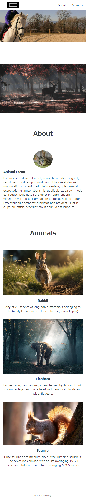

# 演習課題

### [HTML CSSの総合課題](../java/Exercise/JavaWeb/ClientSide/Chapter8)で作成したWebページを改修しましょう  

#### 【要件】
- 画像スライダーを追加  
  - 5秒ごとに次の画像へ自動スライド  
  - [次]と[前]のボタンで手動のスライドが可能
  - 表示する画像は[こちらのリンク](./files/js-practice-image.zip)からダウンロード

  

- Animalsの画像をクリックするとモーダルウィンドウで表示  

  

:::caution
CSSのみで一部要件を満たすこともできますが、極力JavaScriptを使用するようにしましょう
:::

### 全体画像
  

### 以下を参考にスマホページでも表示できるようにしましょう
  

