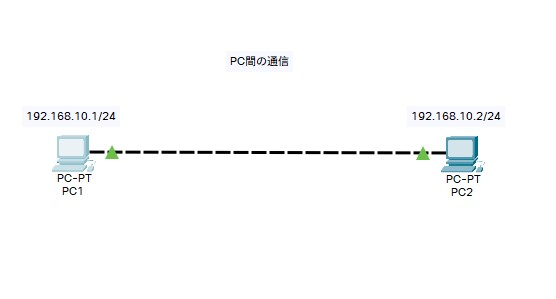
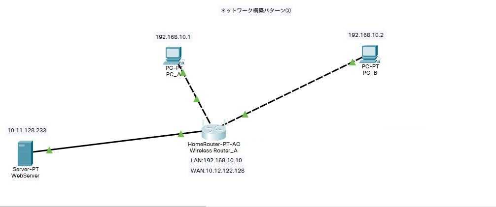
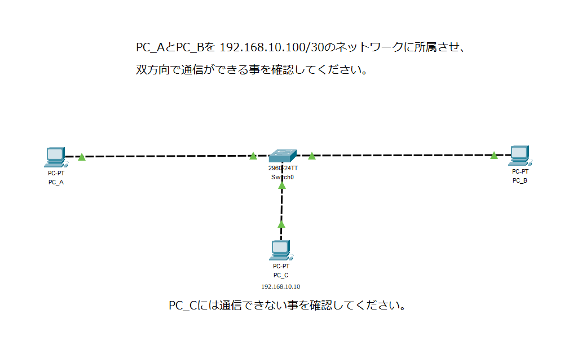
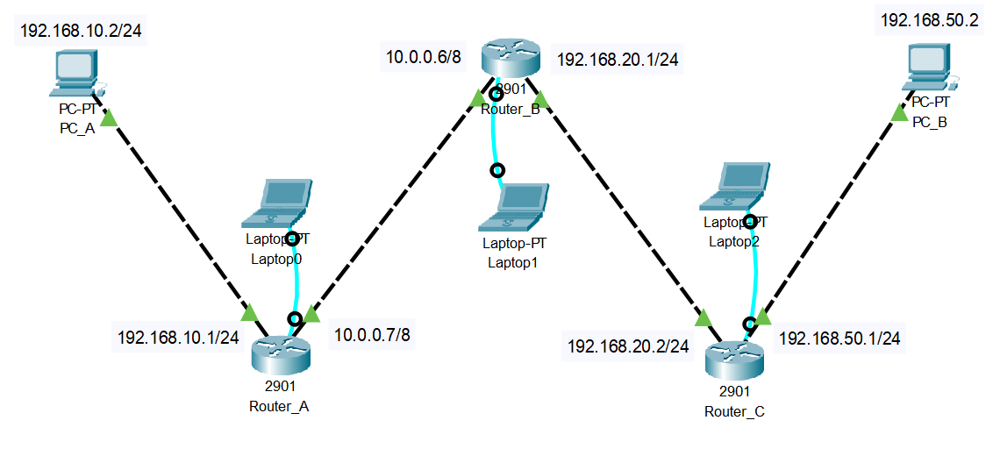

# 4. IPルーティング基礎

    
概要

    

## ルーティング（Routing）
**データを目的地まで届けるために、最適なルート（経路）を選んで転送すること**  
インターネットは無数のネットワークがクモの巣のように繋がっています。  
データは一つのケーブルを直通で通るのではなく、いくつもの「中継地点（ルータ）」をリレー形式で経由して目的地にたどり着きます。

-----

### ルーティングテーブル（経路表）

ルータは**ルーティングテーブル**という地図（対応表）を持っています。  
ルータはデータが来るたびに、この地図を見て「次はどこへ送ればいいか」を判断します。

### ルーティングテーブルのイメージ
| 宛先のネットワーク | 次に行く場所（ネクストホップ） |
| :--- | :--- |
| **192.168.1.0** (A支店) | **ポート0** に出す |
| **192.168.2.0** (B支店) | **ポート1** の隣のルータへ |
| **それ以外全部** (インターネット) | **ポート2** の上のルータへ |

-----

### デフォルトゲートウェイ

PCやスマホの設定画面でよく見る**デフォルトゲートウェイ**もルーティングの重要な要素です。

  * **意味：** **「分からない時は、とりあえずココに送れ」という出口。**
  * **役割：** LANの中にいるPCは、世界中の住所を知りません。  
  だから、「自分と同じLAN宛て以外」の通信は、すべてデフォルトゲートウェイ（＝ルータ）に丸投げします。

<iframe src="https://drive.google.com/file/d/14oZvgu88bBqhYuPRNoIQ6xe4ag00sHI_/preview" width="640" height="360" allow="fullscreen"></iframe>

　

    

    
サンプル構築課題

    

:::tip
以下のサンプル課題を例にハンズオンを行います。  
基本的な使い方をマスターしましょう。
:::

|ゴール|PC間で通信ができること  |
|:--------:|:--------|
|提出物1|ping の結果を講師にSlackで送る|
|提出物2|名前を付けて保存「.pkt」のファイルを講師に送る|
|ポイント|構成図を解読して、配線・各機器の設定を行い、疎通確認をする|
|構成図||  

    

    
構築課題1

    

|ゴール|すべてのコンピュータ間で通信ができること|
|:--------:|:--------|
|提出物1|ping の結果を講師にSlackで送る|
|提出物2|名前を付けて保存「.pkt」のファイルを講師に送る|
|ポイント|構成図を解読して、配線・各機器の設定を行い、疎通確認をする|
|構成図||  

    

    
構築課題2

    

|ゴール1|PCからwebサーバに通信ができること(webサーバからpingを送る必要はありません)|
|:--------:|:--------|
|ゴール2|各PCのブラウザからWebサーバにアクセスして「Webページ」が見れること|
|提出物1|ping の結果を講師にSlackで送る|
|提出物2|名前を付けて保存「.pkt」のファイルを講師に送る|
|ポイント|宛先が異なるネットワークの場合「とりあえずここに向かいましょう」という設定が必要|
|構成図||

    

    
構築課題3

    

|ゴール1|指定したコンピュータ間で通信ができること(VLANは使用しません)|
|:--------:|:--------|
|ゴール2|指定したコンピュータには通信ができない事|
|提出物1|ping の結果を講師にSlackで送る|
|提出物2|名前を付けて保存「.pkt」のファイルを講師に送る|
|ポイント|サブネットマスクでどう表現するか|
|構成図||
    

    
※構築課題4以降について

    

:::caution 課題4以降について

課題4から**ルータとスイッチ**のGUI操作を禁止します  
設定や確認はかならずコマンドで行いましょう  

※PCはこれまで通りGUI設定で問題ありません  
接続は以下のキャプチャのように**構築するネットワークとは関係ない**「作業用のPC」を準備していただき  
コンソールケーブルで直接つないでください  

||ポート名称|
|----|----|
|作業用PC|RS232|
|ルータ|console|

作業用PCのデスクトップから「ターミナル」を選択して接続していただくと、コマンドが入力できる状態になります

:::

    

    
構築課題4

    

以下要件を満たすネットワークを構築してください

|ゴール1|すべてのコンピュータ間で通信ができること(ルータを含め)|
|:--------:|:--------|
|提出物1|ping の結果を講師にSlackで送る|
|提出物2|名前を付けて保存「.pkt」のファイルを講師に送る|
|ポイント|スタティックルーティングの設定|
|構成図||

:::caution
ルータの設定は実務さながら、「設定用のPCを用意してコンソール接続」で設定ください
:::
    

