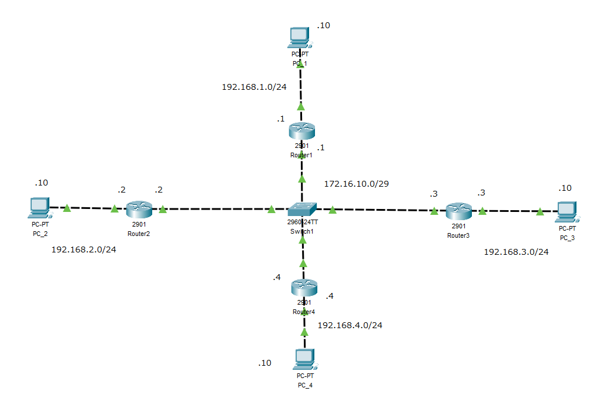

# 5. ダイナミックルーティング

    
概要

    

## ダイナミックルーティング

**ルーター同士がお互いに情報交換をして、自動的に地図ルーティングテーブルを作り上げる仕組み**です。  
人間が設定するのは「隣のルーターと連携して下さい」という最初の命令だけ。あとはルーターたちが勝手にネットワークの形状を学習します。

### スタティックとの決定的な違い

  * **スタティック：** 障害があっても、人間が書き換えるまで道順は変わりません。
  * **ダイナミック：** 障害があれば、自動的にその道を避けて、別のルートを案内してくれます。

-----

### 仕組み

ダイナミックルーティングを設定すると、ルーター同士は定期的に連携（パケットの交換）を始めます。  
この情報の行き渡る状態を**コンバージェンス**（収束）と呼び、これが完了するとすべてのルーターが正しいルーティングテーブルを持ちます。

-----

### 代表的なプロトコル

ルーター同士が会話するには、共通の言語（プロトコル）が必要です。  
規模や用途によって使い分けます。

| プロトコル名 | 正式名称 | 特徴・イメージ | 使われる場所 |
| :--- | :--- | :--- | :--- |
| **RIP** (リップ) | Routing Information Protocol | 単純な仕組み。「ホップ数（経由するルーターの数）」が少ない方を近いと判断する。回線速度は気にしない。古い技術。 | 小規模な社内LAN |
| **OSPF** (オーエスピーエフ) | Open Shortest Path First | 「帯域幅（回線の太さ）」を計算し、**最も速く通信できる道**を選ぶ。現在の主流。 | 中〜大規模な社内LAN 企業の中心部 |
| **EIGRP** (イーアイジーアールピー) | Enhanced Interior Gateway Routing Protocol |Cisco機器が得意とする、非常に高速で高性能なプロトコル。 | Cisco機器で統一された組織 |
| **BGP** (ビージーピー) | Border Gateway Protocol | 組織（AS）と組織を繋ぐためのプロトコル。これがないとインターネットは成立しない。 | **インターネットそのもの** ISP（プロバイダ）間 |

-----

### メリットとデメリット

| メリット（強み） | デメリット（弱み） |
| :--- | :--- |
| **障害に強い（冗長性）** ケーブルが切れても、瞬時に迂回ルートに切り替わるため、通信が止まらない。 | **ルーターが疲れる** 常に計算や情報交換を行うため、ルーターの性能（CPU/メモリ）が必要。 |
| **管理が楽（拡張性）** 新しい支店が増えても、ルーターを繋げば勝手に認識してくれる。 | **知識が必要** 設定が複雑で、トラブルが起きた時の原因究明が難しい。 |

<iframe src="https://drive.google.com/file/d/1du5PLti3QElStNcEPhZ1Rc0Srx-LWaS4/preview" width="640" height="360" allow="fullscreen"></iframe>

　
## ルートの判断基準・優先順位

ルータはあるネットワークへの行き方（ルート）を複数知っている場合、以下のテーブルの**上から優先的に判断**します。

| ルール名 | 定義 | 適用タイミング |
| :--- | :--- | :--- |
| **ロンゲストマッチ** （最長一致） | 宛先IPアドレスに最も長く、**具体的**に一致するルートを優先的に選択する。 | ルーティングテーブルを検索する際、**常に最初**に適用される。 |
| **AD値** | ルートの**情報源**の信頼性を比較する。 | ルートが複数見つかり、かつ**情報源が異なる**場合。 |
| **メトリック** | ルートの**質**（コストや速さ）を比較する。 | AD値が同じで、かつ**同じプロトコル**からルートを学んだ場合。 |

---

### ロンゲストマッチ

ロンゲストマッチ（Longest Match）とは、ルーターがルーティングテーブルを検索する際の基本的なルールで、**AD値やメトリックの比較より前に適用される**、非常に重要な原則です。  
ルーティングテーブルのエントリは、ネットワークアドレスと**プレフィックス長**（/24 のような数字）で登録されています。  
このプレフィックス長が「どれだけ具体的にアドレスを定義しているか」を示しています。

| 宛先ネットワーク | プレフィックス長（サブネットマスク） | 意味（ネットワーク部） |
| :--- | :--- | :--- |
| 192.168.0.0/16 | 16ビット（広範囲） | 192.168.XX.XX |
| 192.168.10.0/24 | 24ビット（中範囲） | 192.168.10.XX |
| 192.168.10.128/25 | 25ビット（狭い範囲） | 192.168.10.128〜255 |

#### 検索例：宛先 192.168.10.130 の場合

1.  ルーターは、宛先IPアドレス 192.168.10.130 がすべてのルートにマッチすることを確認します。
2.  その中で、プレフィックス長が最も長い **/25** のルートが最も具体的だと判断されます。
3.  ルーターは 192.168.10.128/25 のルートを選択し、パケットを転送します。

:::tip 例え話
同じ宛先について3つの地図があるとします。

1.  「関東地方」へのルート
2.  「東京都豊島区」へのルート
3.  「東京都豊島区西池袋3丁目」へのルート

郵便局員は、最も具体的な住所（**3丁目へのルート**）を使って配達します。これがロンゲストマッチの考え方です。
:::

--- 

### AD値
次に**アドミニストレーティブディスタンス (AD値)**という**信頼性スコア**を比較します。  
このAD値が**最も低いルート**が、最も信頼できる情報と判断されます。

#### AD値（信頼性スコア）

| 経路の取得方法 | AD値 | 信頼性（優先度） | 解説 |
| :--- | :--- | :--- | :--- |
| **直接接続** (Directly Connected) | **0** | **一番高い** | ケーブルが直接繋がっているルーター自身のポート情報。最も正確で、絶対に優先される。 |
| **スタティックルート** (Static Route) | **1** | **極めて高い** | 管理者（人間）が手動で設定したルート。絶対的な命令として扱われる。 |
| **EIGRP** (内部) | **90** | **高い** | Cisco独自の高信頼プロトコル。 |
| **OSPF** | **110** | **標準** | 現在の標準的な動的ルーティングプロトコル。 |
| **RIP** | **120** | **やや低い** | 最もシンプルなプロトコル。古い情報の場合があるため、優先度は低い。 |
| **外部ルート** (Unknown) | **255** | **最弱** | 信頼できない情報。このルートは使われません（無視）。 |

---

### メトリック

メトリックとは、ルーターが**同じ宛先への複数のルート**の中から、**最も効率的（ベスト）なルートを選ぶための判断基準**となる数値です。  
簡単に言えば、ルートの**コスト**や**距離**を表します。

数値は、**低いほど優先度が高く、優秀なルート**と判断されます。

#### AD値との関係（判断順序）

メトリックは、**アドミニストレーティブディスタンス**（AD値）の次の段階で使われます。

1.  **AD値の比較:** **異なるプロトコル**からルートを学んだ場合、AD値が低い方を優先する。
2.  **メトリックの比較:** **同じプロトコル**から複数のルートを学んだ場合、メトリックが低い方を優先する。

#### プロトコルごとのメトリックの考え方（例）

メトリックの計算方法は、使用するダイナミックルーティングプロトコルによって異なります。

| プロトコル | メトリックの基準 | 意味するコスト |
| :--- | :--- | :--- |
| **RIP** | **ホップ数** (Hop Count) | **「経由するルーターの数」** ルーターの数が少ないルートを優先する（回線の品質は考慮しない）。 |
| **OSPF** | **コスト** (Cost / Bandwidth) | **「回線の帯域幅（太さ）」** 帯域幅が広い（速い）ルートを優先する。現在の主流な判断基準。 |
| **EIGRP** | **複合値** | **「帯域幅 + 遅延」** 非常に複雑な計算式で、最も正確なルートの品質を算出する。 |

<iframe src="https://drive.google.com/file/d/1EK4UXL4HChCrmVrBH1UhQDkLH48m7rv4/preview" width="640" height="360" allow="fullscreen"></iframe>

　

## OSPF必須コマンド集

| 目的 | コマンド（略称） | モード | 解説 |
| :--- | :--- | :--- | :--- |
| **① OSPFの有効化** | `router ospf [Process ID]` | `(config)#` | OSPFルーティングプロセスを起動します。`[Process ID]`はルーター内で一意であれば任意の数値でOKです。 |
| **② ルーターIDの設定** | `router-id [IPアドレス]` | `(config-router)#` | そのルーターをOSPFネットワーク内で一意に識別するためのIDを設定します。 |
| **③ 参加ネットワーク定義** | `network [IP] [Wildcard Mask] area [Area ID]` | `(config-router)#` | どのネットワークをOSPFに参加させるか、そしてどのエリアに所属させるかを定義します。 |
| **④ ネイバー確認** | **`show ip ospf neighbor`** (`sh ip ospf nei`) | `#` | 隣接するルーターとの接続状態（ネイバー関係）が確立しているかを確認します。 |
| **⑤ OSPFルート確認** | **`show ip route ospf`** (`sh ip ro ospf`) | `#` | ルーティングテーブルの中から、OSPFが学習したルートのみを抽出して表示します。 |
| **⑥ OSPF全体確認** | **`show ip ospf`** | `#` | OSPFのプロセスID、エリア情報、ルーターID、タイマーなど、プロセス全体の詳細情報を確認します。 |

-----

:::tip 補足：Wildcard Mask と Area ID

  * **[Wildcard Mask]**：サブネットマスクの反転のようなものです。`0` の部分は「一致させる」、`255` の部分は「何でもよい」という意味になります。
      * 例: サブネットマスク $255.255.255.0$ の場合のワイルドカードマスクは $0.0.0.255$ です。
  * **[Area ID]**：OSPFが動作するネットワークを分割する番号です。**`Area 0`**（バックボーンエリア）が中心となり、基本はここから始めます。
:::

　

    

    
構築課題

    

以下要件を満たすネットワークを構築してください

- 各ルータに**シングルエリアOSPF**の設定を行う
- 各ルータに**プロセスID**及び**ルータID**は以下の様に設定する

||プロセスID|ルーターID|
|---|:---:|:---:|
|router1|1|1.1.1.1|
|router2|2|2.2.2.2|
|router3|3|3.3.3.3|
|router4|4|4.4.4.4|

- プライオリティをrouter1が**DR**、router2が**BDR**になるように調整する
  ※プライオリティ値は任意で設定する
- PC向けの**Helloパケット**が発生しないように設定する
- Hello間隔を5秒に変更する
- PC間での**icmp**を可能にする

#### 構成図

    

    
確認問題

    

以下のファイルをダウンロードし、回答を記入して担当講師に送信して下さい。

[**確認課題**](./files/6.ルーティングに関する問題_確認課題_名前.xlsx)
    

