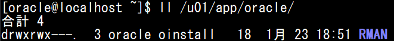
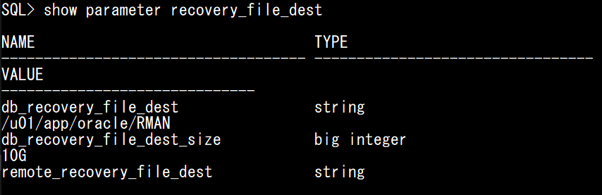
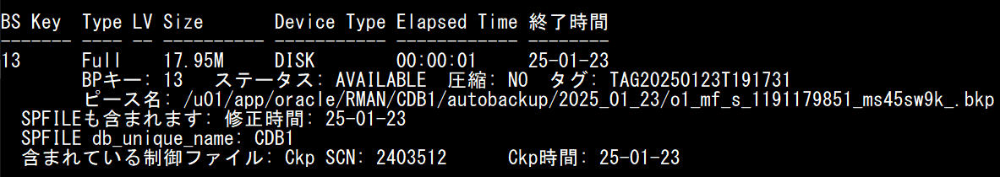
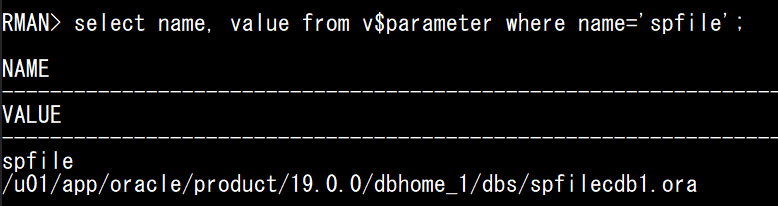
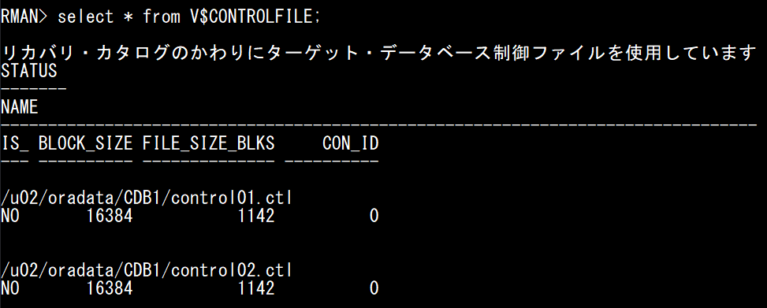
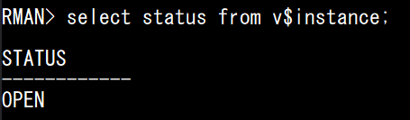

# OracleDB 指示書 4

## バックアップ/リカバリ

教科書の内容等を参考にしながら以下の課題を実施しましょう。  
また、OracleDBのバックアップ及びリカバリについてはかなり複雑です。  
正確な情報を得るためにも[**公式ユーザーズガイド**](https://docs.oracle.com/cd/F19136_01/bradv.pdf)を活用しましょう。

その他にも[**RMAN関連の用語集**](./reading/page12.md)を用意しているので、こちらも必要であれば併用して下さい。


## バックアップ課題
### 概要
課題用にバックアップディレクトリを作成し、障害発生時に必要となるバックアップセットを格納します。  
必要最低限の設定で問題ありませんが、本番環境ではクリティカルな内容になり得るため**実行するコマンドによって何が起こるか**を意識して着手しましょう。  

---

1. **バックアップディレクトリ作成**  
`/u01/app/oracle/` に `RMAN` というディレクトリを作成して下さい。  
作成したディレクトリに、以下のような権限設定になるようにコマンドを実行しましょう。


2. **バックアップディレクトリ変更**  
`alter system` コマンドを使用して、バックアップディレクトリを上記で作成したパスに設定して下さい。  

3. 高速リカバリ領域におけるディスク割当てを10GBに変更する  
`alter system` コマンドを使用して、バックアップディレクトリ領域を10GBに設定して下さい。  

:::tip
以下のコマンドで高速リカバリ領域におけるディスク割当ておよび現在のディスクの使用状況に関する情報を示します。  
実行して設定ができているかどうか、確認してみましょう。
```sql
show parameter recovery_file_dest
```
[公式リファレンス](https://docs.oracle.com/cd/E82638_01/refrn/DB_RECOVERY_FILE_DEST_SIZE.html#GUID-FA2F9735-DD0E-4026-96F0-80AF0E5E6E64)



:::


4. **バックアップ**  
`rman` を使用し、**データベース全体**及び**全てのアーカイブログ**をバックアップして下さい。

:::danger
バックアップできていないと復旧ができません。  
本番環境を想定して慎重に作業を行いましょう。

以下のコマンドでバックアップ履歴を確認することができます。  
`BS Key` 列が最大値の行(最新のバックアップ)を参照しましょう。  
※後のリストア・リカバリで**ピース名**の値(バックアップセットのフルパス)を使用するので控えておきましょう。
```sql
list backup;
```



:::


## 擬似的な障害発生
### 概要
この課題ではデータベースにおける主要なファイルが物理的に破損又は削除されたことを想定しています。  
障害の状況を作り出すためにdbsでディレクトリ内の重要なファイルを含め全て削除します。  

---

以下の手順に沿って意図的に障害を発生させて下さい。

1. **データベース停止**  
```sql
shutdown abort
```

2. **データベース構成ファイル削除**
```bash
rm -rf /u01/app/oracle/product/19.0.0/dbhome_1/dbs/*
```


## リストア・リカバリ課題

### 概要  
意図的にOracleDB内の構成ファイルを物理的に削除したことにより、sqlplusで接続しようとしても失敗するはずです。  
初期化パラメータを管理する**SPFILE**という重要なファイルも同時に削除されているため、インスタンスの起動もできません。    

---

1. **ダミーインスタンスの起動**  
SPFILEを復元するためには `rman` を使用する必要があります。  
まずはダミーインスタンスを起動して `rman` で接続しましょう。

2. **SPFILEリストア**  
バックアップ課題の手順4. で控えたバックアップセットファイルからSPFILEをリストアして下さい。  
以下のコマンドでSPFILEがリストアされたかどうかを確認しましょう。
```sql
select name, value from v$parameter where name='spfile';
```



3. **ダミーインスタンスを停止し、データベースをマウントせずにインスタンスを起動して下さい。**  

4. **CONTROLFILEリストア**  
バックアップ課題の手順4. で控えたバックアップセットファイルからCONTROLFILEをリストアして下さい。  
以下のコマンドでCONTROLFILEがリストアされたかどうかを確認しましょう。  
```sql
select * from V$CONTROLFILE;
```


5. **マウントし、データベースのリストア及びリカバリを実行して下さい。**  
:::caution
リカバリの際は、使用可能な最新のアーカイブREDOログとオンラインREDOログを検索し、ログが存在しないポイントまでデータベースを回復しましょう。  
:::
6. **データベースが復旧したかどうかを確認して下さい。**  
以下のコマンドでインスタンスが起動しているかどうかを確認しましょう。  
```sql
select status from v$instance;
```


