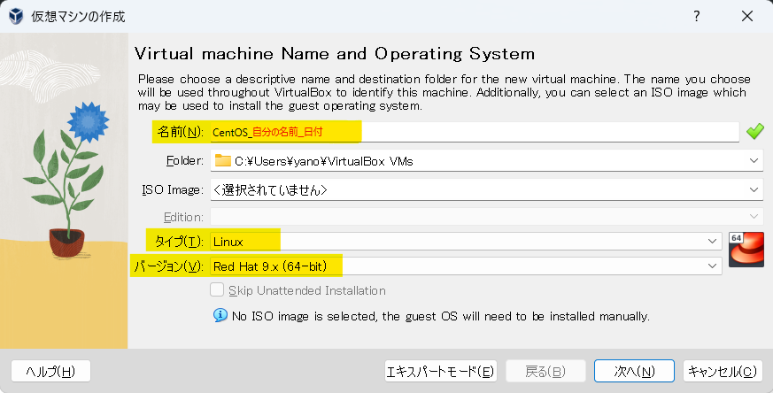
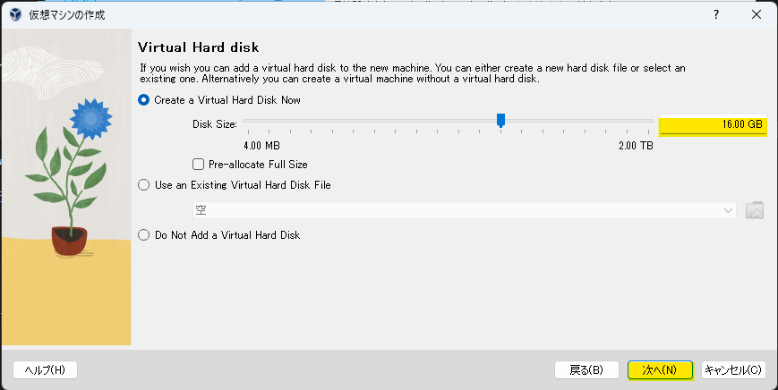
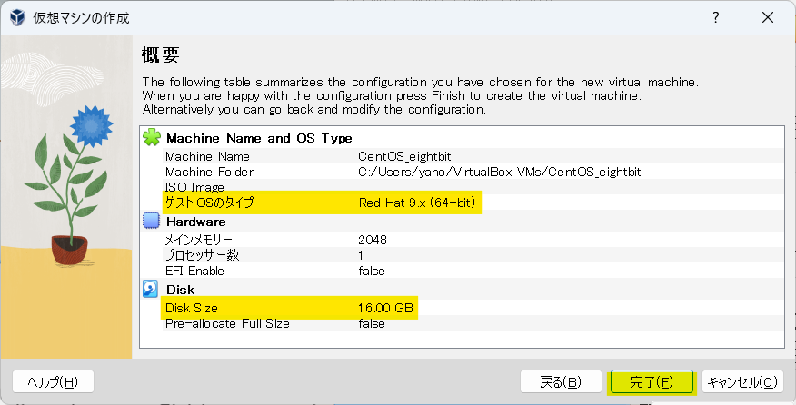
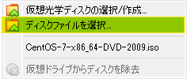
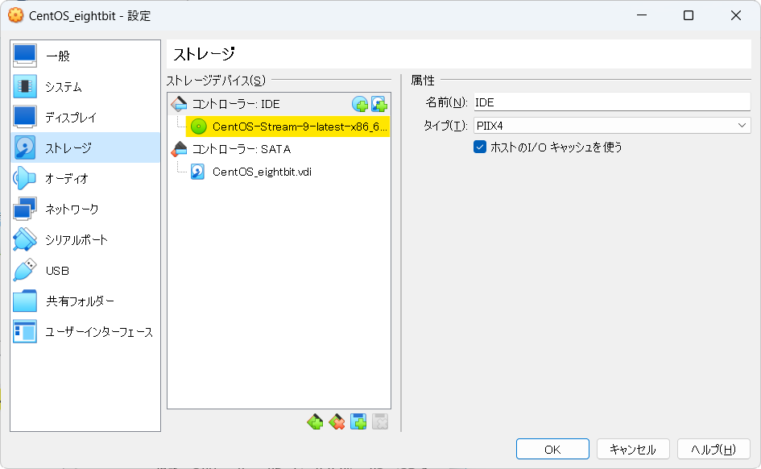
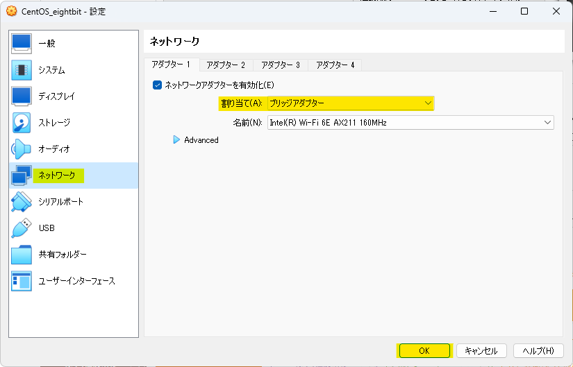
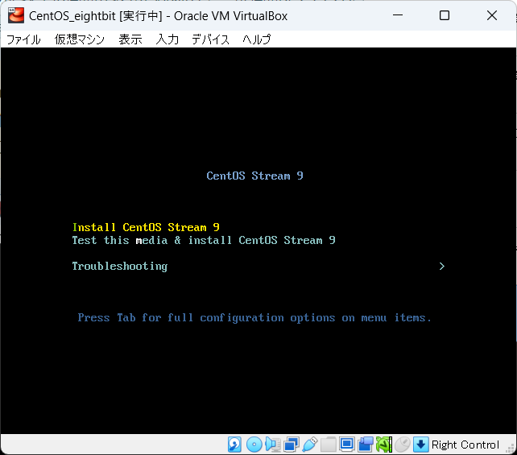
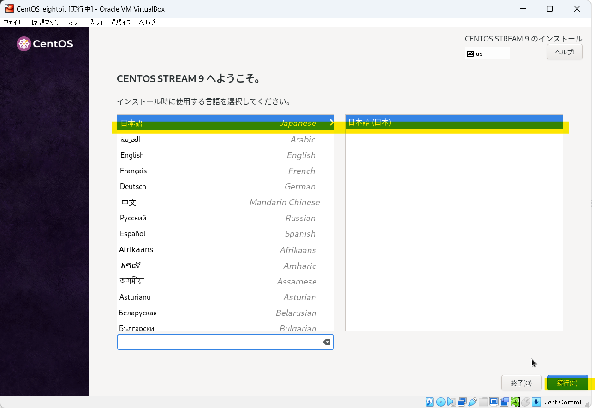
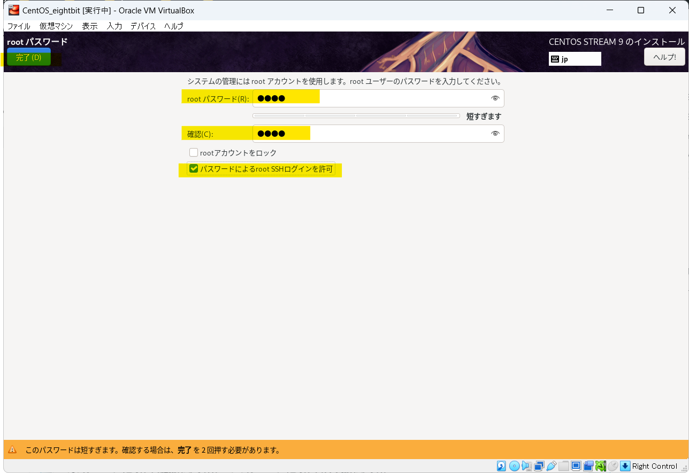

# Linux環境構築

    
導入

    

## 環境確認

### 1. CentOSイメージファイル  

仮想マシンにインストールするイメージファイルです  
約 **2GB** のファイルですので、予めダウンロードしてデスクトップ等、わかりやすい場所に移動しておきましょう  

※実行する必要はありません

[AlmaLinux8イメージファイル](https://repo.almalinux.org/almalinux/8.10/isos/x86_64/AlmaLinux-8.10-x86_64-minimal.iso)

### 2. VirtualBox

**まずはお使いのPCにインストールされているかを確認して下さい**  
仮想環境を構築するためのアプリケーションです  
WindowsPCの中に仮想的にCentOS(LinuxPC)を構築します  
ダウンロード完了したら実行し、インストールまで済ませましょう  

[VirtualBoxインストーラ](https://download.virtualbox.org/virtualbox/7.1.4/VirtualBox-7.1.4-165100-Win.exe)

### 3. teraterm

VirtualBox上に構築した仮想マシンに対して、SSH接続して操作するためのアプリケーションです  

:::note
SSH（Secure Shell）とは、ネットワークを介して別のコンピューターやネットワーク機器などを操作するために使われるプロトコルです。
:::

ダウンロード完了したら実行し、インストールまで済ませましょう

[teratermインストーラ](https://github.com/TeraTermProject/teraterm/releases/download/v5.2/teraterm-5.2.exe)

    

    
1. 仮想マシン作成手順

    

### 仮想マシン作成

:::caution
画像はCentOSの仮想マシン作成時のものです。  
本研修ではAlmaLinux8を使用しますので、置き換えて閲覧して下さい。
:::

**VirtualBoxマネージャ画面**  

VirtualBoxを起動し、以下の画面を表示したら**右上**の `新規` をクリック

**仮想マシン概要設定画面**  

黄色いハイライト部分を画面と同じ様に設定しましょう
- 名前 → 仮想マシンの名前(任意の名前で構いません)
- タイプ → **Linux**
- バージョン → **Red Hat 8.x (64bit)**

設定したら `次へ` をクリック

**ハードウェアリソース設定画面1**  

メモリ容量とCPU割当の設定画面です  
特に変更せずに `次へ` をクリック

**ハードウェアリソース設定画面2**  

ストレージ容量設定画面です  
黄色ハイライトの箇所を `48.00 GB` に設定して `次へ` をクリック

**仮想マシン設定概要画面**

作成する仮想マシンの概要を確認する画面です  
ここまでの設定が反映されている事を確認し、`完了` をクリック

**VirtualBoxマネージャ画面**  

左側に赤い帽子の項目が表示されます(これが一つの仮想マシンです)  
該当項目を右クリックし、`設定` をクリック

**仮想マシン設定画面(ストレージ)**

`ストレージ` > `空` > 右上の`◎` を順にクリック

以下の選択項目からは `ディスクファイルを選択` をクリックし、  
[導入](#1-centosイメージファイル)でダウンロードしたCentOSのイメージファイルを選択します  

イメージファイルを選択後、元の画面に戻ります  
黄色ハイライト部分が `AlmaLinux-8.10-x86_64...` のような表記になっている事を確認して下さい

同画面左の `ネットワーク` > `割り当て` のドロップダウンリストを開き、  
**ブリッジアダプター** を選択して `OK` をクリックして下さい

以上で仮想マシンの作成は完了です
    

    
2. CentOSインストール手順

    

### CentOSインストール

以下の画面から作成した仮想マシンをクリックした状態で右上の `起動` をクリック

**仮想マシン画面**

仮想マシンは別ウィンドウで動作を確認することができます  
最初に以下の画面が表示されるので、一度画面をクリックし、`↑` キーを押し、  
 `Install CentOS 9` にカーソルを合わせた状態で `Enter` キーを押して下さい

 :::caution
仮想マシンの画面をクリックすると**ホストOS側(Windows)のマウス**が動かせなくなります  
これは**右の** `ctrl` キーを押すことで解消します  
 :::

**CentOSインストール画面**

しばらく待つと以下のような画面が表示されます  
言語選択では特に理由がない限り `日本語` を選択し、`続行` をクリック

`インストール先` をクリック

以下の画面が表示されたら、**特に何も操作せず** `完了` をクリック

 `ROOTパスワード` をクリック

黄色ハイライト部分に `root` と入力し、  
 `パスワードによるroot SSHログインを許可` にチェックを入れて
`完了` を**2回**クリック  

:::danger
ここでは仮想マシンの管理者ユーザのパスワードを設定しています  
設定したパスワードを忘れてしまうと1からCentOSをインストールすることになります  
本来好ましくありませんが、研修中に**ログインできない**等の余計なトラブル防止のため、パスワードは `root` に設定しましょう  

`パスワードによるroot SSHログインを許可`   
とは皆さんが作成した仮想マシンにトラブルが発生した際、講師のPCからアクセスするために必要な設定です    
チェックを入れないと対応が大幅に遅れてしまうため、忘れないようにして下さい  
:::

以下の画面で黄色ハイライト部分が同じような表示になっている事を確認し、 `インストールの開始` をクリック  
**※ユーザの作成はしていない状態で問題ありません。**  
インストールが始まりますがしばらく時間がかかります  
:::note
GUIを使用しない(**Minimal Install**)の場合は比較的短時間で完了します  
:::

インストールが完了すると以下のように**右下**に `再起動` ボタンが表示されるのでクリック  

再起動後、以下の画面が表示されるので  
`localhost login:` に**root**と入力し、`Enter`  

下に `Password:` と表示されるので**root**のパスワード入力し、`Enter`
:::caution
パスワードを入力する際、一見キーボードが反応していないように思えますが、入力はされています  
ユーザのパスワードを盗み見られる事を忌避し、パスワードは画面には表示されない仕様です  
:::

`[root@localhost ~]#` の表示が出ていればサインインは完了です  

    

