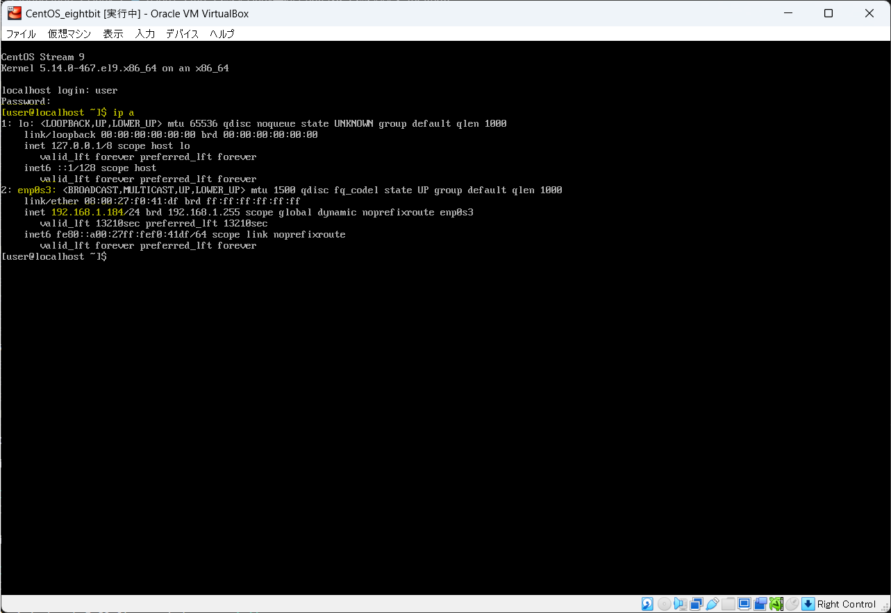
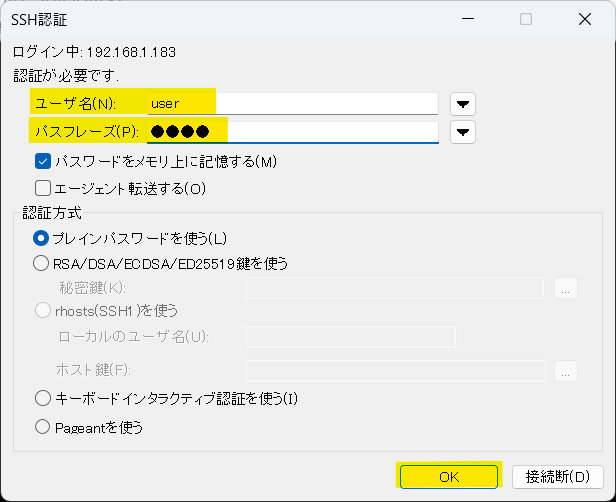

# SSH接続

:::caution
※以下の手順を実施するには、事前にネットワークインターフェースの設定が必要です
:::

`[root@localhost ~]#` が表示されている状態で `ip a`と入力して `Enter` キーを押し、  
画面と同じような結果が出てくることを確認して下さい   

次に黄色ハイライト部分を確認し、その仮想マシンに割り当てられている **IPアドレス** を控えておきましょう

teratermを起動し、**ホスト** 欄に先ほど確認した IPアドレス を入力して `OK` をクリック

初回接続時のみ以下の画面が表示されます  
特に何も操作せず `続行` をクリック

**root** のユーザ名とパスワードを入力し、`OK` をクリック

以下の黒い画面が表示されれば **SSH接続** は完了です

