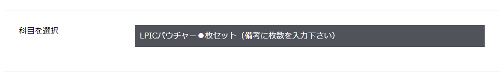
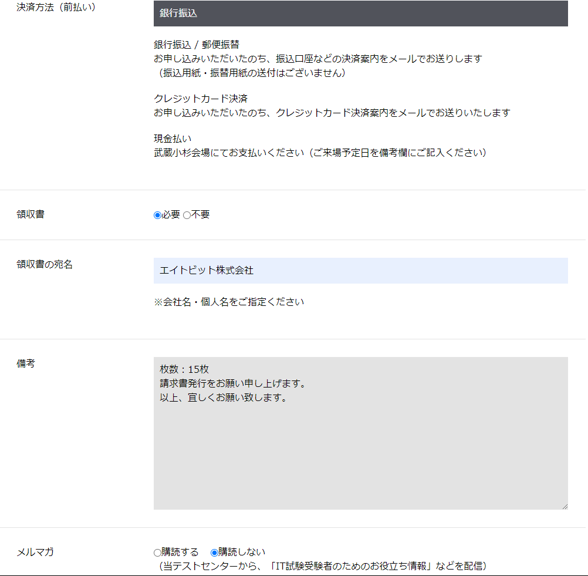
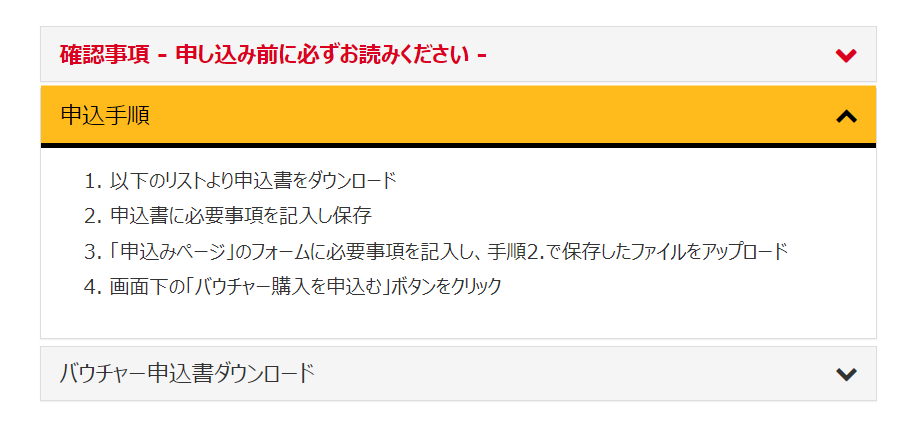
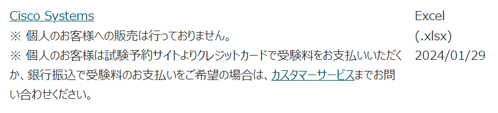

# バウチャー管理

## 共通フロー
1. 稟議書作成&提出  
2. 決裁が下りたら購入
3. 請求書、稟議書、振込依頼書をまとめて管理部に提出

## LPIC

    
LPICバウチャー購入フロー

    

LPICは[**バウチャーチケット購入センター**](https://voucherticket.jp/lpicpurchase/)にて購入  
他で買うより10%の割引があり、請求書発行(銀行振込)に対応している

以下の「科目を選択」では「●枚セット」を選択し、後述の備考欄に枚数を記入する  

:::note
このバウチャーはLPIC101, 102両方で使用可能
:::

以下の項目は画像の通り  
備考欄では枚数の指定、請求書発行の旨を記述すること
:::danger
このページに記載はないが、[**別ページ**](https://voucherticket.jp/faq/)に請求書発行に対する注意書きがある  
**請求書の発行は10枚以上から対応可能**であるため、ある程度まとめて購入する
:::

フォーム送信後、記入したメールアドレス宛に確認メールが送信される  
数日後、**【請求書】送付のご案内（株式会社ブレイクスルーから）** というメールが届く  
該当メール内リンクから請求書をダウンロードし、振込依頼書と併せて管理部に提出

振込後すぐ、**【ブレイクスルー】バウチャーチケットの送付** というメールが届く  
メールに記載されているバウチャー番号を [**二次研修LPICバウチャー**](https://docs.google.com/spreadsheets/d/1dz9dTVYxe7m4sdT3VZxFGKS9K67g6W6Qsnn3Olwl03U/edit?usp=sharing) のLPICバウチャーシートに転記  

:::caution
購入日、有効期限、提供者も記入すること
:::

   

    
LPIC予約フロー

    

### 研修生にやってもらうこと

#### アカウント作成について

1. LPI ID  
試験予約のために *LPI ID* が必要なので、[**こちら**](http://esx11954.github.io/eightbit-saurus/docs/LPI/lpi-id) を展開して *LPI ID* を取得してもらう  
<!-- 提出された *LPI ID* は [**こちら**](https://docs.google.com/spreadsheets/d/1VJhO4qJf90UNii9t8up64FkTGuIZlJ7RKFWUAHhhvE0/edit?usp=sharing) で確認できる   -->

2. PearsonVUE  
同じく予約をする際、*LPI IDとPearsonVUEアカウント紐付け* も必須なので、[**こちら**](https://wsr.pearsonvue.com/testtaker/profile/create/SignUp.htm?clientCode=LINUXPROFESSION&locale=ja_JP) も展開して完了してもらう  

:::danger
上記2つは試験内容変更や試験結果閲覧の際に必要になる重要なアカウントです  
忘れないように保管させること
:::

#### 受験日の調整について
PearsonVUEアカウントで [**こちら**](https://wsr.pearsonvue.com/testtaker/signin/SignInPage.htm?clientCode=LINUXPROFESSION) にサインインし、  
受験予定のテストセンターの日程を確認し、受験日時を決定してもらう  

#### 予約について
受験日時確定後、各研修性にバウチャーを払い出し、予約してもらう

### 予約確定後
予約情報は[**二次研修LPICバウチャー**](https://docs.google.com/spreadsheets/d/1dz9dTVYxe7m4sdT3VZxFGKS9K67g6W6Qsnn3Olwl03U/edit?usp=sharing)に随時記入する

   

## CCNA

    
CCNAバウチャー購入フロー

    

CCNAのバウチャーは [**PearsonVUE**](https://www.pearsonvue.co.jp/Test-takers/Voucher-store.aspx) で購入する  
提供者はCISCO、又はpearson vueのみ  
どちらも割引なしなので選択の余地はなくpearsonVUE経由で購入
※こちらも請求書発行は対応している

PearsonVUEにおけるバウチャー購入申請手順は以下の画像の通り  

**バウチャー申込書ダウンロード** の箇所を開き、  
スクロールすると以下の **Cisco Systems** 用の申込書ダウンロードリンクがあるので、これをダウンロードする  

ダウンロード後、以下のサンプルを参考に必要事項を記入する  
[**サンプル申込書**](./files/Cisco_Voucher_20231011.xlsx)

ファイル作成が完了したら以下のページのフォームから購入申請ファイルをアップロードして送信する  
[**バウチャー購入申請ページ**](https://www.pearsonvue.co.jp/Test-takers/Voucher-store/apply.aspx)

購入申請が完了してから2営業日程度で **PearsonVUE バウチャー請求書** というメールが届く  
添付されている請求書をダウンロードし、振込依頼書と併せて管理部に提出

振込完了後、数営業日後に **Pearson VUE バウチャーご納品** というメールが届く  
領収書とバウチャー番号が記載されたExcelファイルが届くので、[**二次研修CCNAバウチャー**](https://docs.google.com/spreadsheets/d/1Q11cicvoUxGbiwUKqsTS2Ca1SrDuhhKW5JKK3nOJlzE/edit?usp=sharing) のCCNAバウチャーシートに転記する   

:::caution
領収書も一応保管すること
:::
   

    
CCNA予約フロー

    

### 研修生にやってもらうこと

#### アカウント作成について
試験予約のために *CISCOアカウント* が必要なので、[**こちら**](https://esx11954.github.io/eightbit-saurus/docs/CCNA/csco-id/) を展開して *CiSCOアカウント* を取得してもらう  

:::danger
CISCOアカウントは試験内容変更や試験結果閲覧の際に必要になる重要なアカウントです  
忘れないように保管させること
:::

#### 受験日の調整について
CiSCOアカウントで [**こちら**](https://www.pearsonvue.co.jp/Clients/Cisco.aspx) からログインし、受験予定のテストセンターの日程を確認し、受験日時を決定してもらう  

#### 予約について
受験日時確定後、各研修性にバウチャーを払い出し、予約してもらう

### 予約確定後
予約情報は[**二次研修CCNAバウチャー**](https://docs.google.com/spreadsheets/d/1Q11cicvoUxGbiwUKqsTS2Ca1SrDuhhKW5JKK3nOJlzE/edit?usp=sharing)に随時記入する

   

