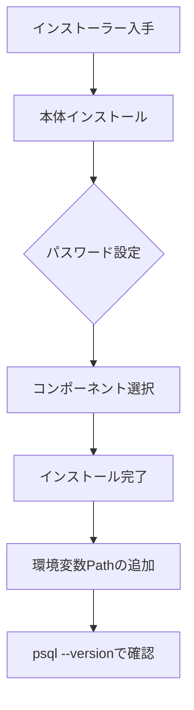
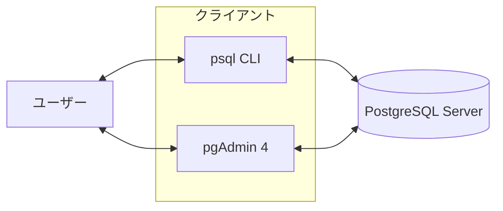

# 1-3. 用語整理とPostgreSQLへの接続・操作方法

## 主要用語の整理

| 用語 | 説明 |
| :--- | :--- |
| **RDBMS** | Relational DataBase Management System。DBを管理するソフトウェア（PostgreSQL自体のこと） |
| **データベース** | テーブルやビューなどをまとめる入れ物 |
| **スキーマ** | データベース内のオブジェクト（テーブル等）をグループ化する名前空間。デフォルトは `public` |
| **テーブル** | 行と列で構成されるデータの格納単位 |
| **レコード（行）** | テーブル内の1件のデータ |
| **カラム（列）** | テーブルの各属性。データ型が決まっている |
| **主キー (PK)** | レコードを一意に識別するための列 |
| **外部キー (FK)** | 他テーブルの主キーを参照する列 |
| **インデックス** | 検索を高速化するための索引構造 |
| **ビュー** | SELECTの結果を仮想テーブルとして定義したもの |

---

## インストール手順

本研修では PostgreSQL 17 を使用します。

### ステップ1. インストーラーの入手とインストール

1. [公式サイト（EnterpriseDB）](https://www.enterprisedb.com/downloads/postgres-postgresql-downloads) から自分のOSに合ったインストーラーをダウンロードします。
2. インストーラーを実行し、以下を設定します。
   - **Components**: `PostgreSQL Server`, `pgAdmin 4`, `Stack Builder`, `Command Line Tools`
   - **Password**: `root` に設定して下さい
   - **Port**: デフォルトの `5432` でOK
   - **Locale**: `C`（または `Japanese, Japan`）

:::caution パスワードの重要性
本番環境では望ましくありませんが、ここで設定するパスワードは一律で「root」に設定して下さい。  
パスワードを忘れてしまうと一切操作出来ないため研修中の特別措置とします。
:::

### ステップ2. 環境変数の設定（Windows）

コマンドプロンプトや PowerShell で `psql` コマンドを使えるようにします。

1. **システムのプロパティ** → **環境変数** を開く
2. **システム環境変数** の `Path` を選択し「編集」をクリック
3. `C:\Program Files\PostgreSQL\17\bin` を追加

### ステップ3. 接続確認

```powershell
# バージョンの確認
psql --version
# PostgreSQL 17.x と表示されればOK
```



---

## DBクライアントの使い分け

PostgreSQL に接続する方法は大きく2つあります。

### psql（コマンドラインインターフェース / CLI）

コマンドプロンプトやターミナルから直接SQLを入力する方法です。
自動化スクリプトやサーバー上でのメンテナンスに必須です。

**接続コマンド**

```bash
# -U: ユーザー名, -d: データベース名, -h: ホスト名, -p: ポート番号
psql -U postgres -d postgres
```

**よく使うメタコマンド（バックスラッシュコマンド）**

| コマンド | 内容 |
| :--- | :--- |
| `\l` | データベース一覧を表示 |
| `\c データベース名` | データベースに切り替え |
| `\dt` | テーブル一覧を表示 |
| `\d テーブル名` | テーブル定義を表示 |
| `\du` | ユーザー（ロール）一覧を表示 |
| `\i ファイル名` | SQLファイルを実行 |
| `\q` | 終了 |

### pgAdmin 4（グラフィカルユーザーインターフェース / GUI）

PostgreSQL に標準で付属するブラウザベースの管理ツールです。

**主な機能**

| 機能 | 説明 |
| :--- | :--- |
| **Query Tool** | SQLを記述・実行し、結果をグリッドで表示 |
| **Dashboard** | 接続中のユーザーやサーバー負荷を確認 |
| **Database Object** | フォルダ形式でテーブルやビューの定義を確認 |
| **Import/Export** | CSVデータのインポート・エクスポート |

:::tip 使い分けの基準
- **開発・デバッグ中**: `pgAdmin 4` で視覚的にデータを確認する
- **実運用・自動化**: `psql` でSQLファイルを一括実行する
:::

### 接続の仕組み


