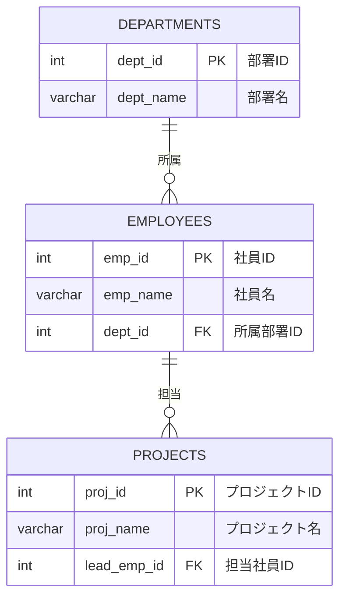

# 2-1. DDLの概要

## DDLとは

DDL（Data Definition Language）は、データベースの**構造**を定義・変更・削除するための言語です。
テーブルやインデックスなど、データを格納する「入れ物」を作る作業がDDLにあたります。

| コマンド | 役割 |
| :--- | :--- |
| `CREATE` | オブジェクト（テーブル・ビュー等）を作成する |
| `ALTER` | オブジェクトの定義を変更する |
| `DROP` | オブジェクトを削除する |
| `TRUNCATE` | テーブルの全データを高速削除する（構造は残る） |

:::caution DDLは即時反映される
PostgreSQLではDDL文もトランザクション内で実行できますが、多くのRDBMSと異なり `COMMIT` なしに即時反映されることを意識しておきましょう。
:::

---

## データベース設計と正規化

テーブルを作成する前に、**どのようなテーブルを作るか**を設計する必要があります。
設計の基本プロセスが「正規化」です。

### 正規化のステップ

**非正規形（Excelのような表）**

1つのセルに複数の値が入っていたり、同じ情報が繰り返されている状態です。

**第1正規形（1NF）**

「1つのセルには1つの値」を徹底し、行を一意に識別する**主キー（PK）**を定義します。

**第2正規形（2NF）**

主キーの一部にだけ依存するデータ（部分関数従属）を別テーブルに切り出します。

**第3正規形（3NF）**

主キー以外の列に依存するデータ（推移的関数従属）を別テーブルに切り出します。
例：部署コードに依存する部署名を別テーブルにする。

:::note なぜ正規化するのか？
- **データの重複をなくす**: ストレージを節約し、修正を1箇所で済ませるため
- **不整合を防ぐ**: 部署名が変わったとき、1箇所を直せば全体に反映されるようにするため
:::

---

## ER図

設計したテーブル同士のつながりを図解したものです。
本研修では「社員（employees）」「部署（departments）」「プロジェクト（projects）」の3テーブルを使います。

## PKとFKの役割

| キー | 正式名称 | 役割 |
| :--- | :--- | :--- |
| **PK** | Primary Key（主キー） | その行を一意に識別する。重複・NULLは不可 |
| **FK** | Foreign Key（外部キー） | 他テーブルのPKを参照する。リレーションを構築する |
