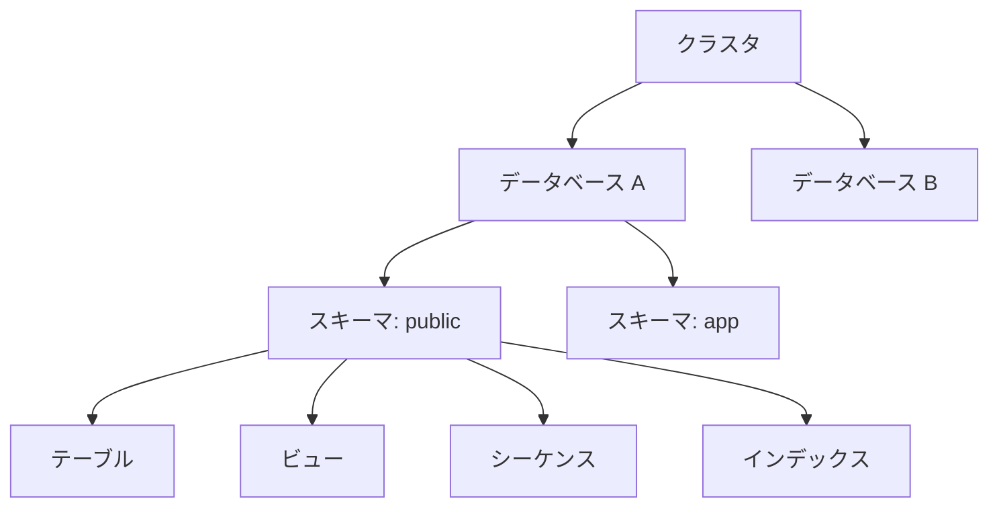

# 2-2. PostgreSQLの内部構成

## オブジェクト階層

PostgreSQLのデータは以下の階層構造で管理されています。

```
クラスタ（インスタンス）
└── データベース
    └── スキーマ
        ├── テーブル
        ├── ビュー
        ├── シーケンス
        ├── インデックス
        └── 関数 / プロシージャ
```



---

## 各レベルの説明

### クラスタ（インスタンス）

PostgreSQLサーバー1つが管理するデータ全体の単位です。
`PGDATA` 環境変数が指すディレクトリ（データディレクトリ）に格納されます。

```
C:\Program Files\PostgreSQL\17\data\   ← データディレクトリ
```

### データベース

クラスタ内に複数作成できる独立した名前空間です。
**異なるデータベース間では、直接SQLで参照できません**（`dblink` 等の拡張が必要）。

```sql
-- データベース一覧の確認
\l

-- データベースの作成・削除
CREATE DATABASE mydb;
DROP DATABASE mydb;
```

### スキーマ

データベース内のオブジェクトをグループ化する名前空間です。
デフォルトでは `public` スキーマが使用されます。

```sql
-- スキーマの作成
CREATE SCHEMA app;

-- スキーマを指定してテーブルを参照
SELECT * FROM app.employees;

-- スキーマ検索パスの設定（省略時にどのスキーマを見るか）
SET search_path TO app, public;
```

:::tip スキーマを使う理由
- 同名テーブルを別スキーマに共存させられる（例：`dev.orders` と `prod.orders`）
- ユーザーごとにアクセスできるスキーマを分けることでセキュリティを高められる
:::

### テーブル空間（Tablespace）

テーブルやインデックスの**物理的な保存先ディレクトリ**を指定する仕組みです。
通常は意識する必要がありませんが、ディスクの使い分けや性能チューニング時に活用します。

```sql
-- テーブル空間の作成
CREATE TABLESPACE fast_disk LOCATION '/mnt/ssd/pgdata';

-- テーブル作成時にテーブル空間を指定
CREATE TABLE logs (...) TABLESPACE fast_disk;
```

---

## システムカタログ

PostgreSQLはデータベースの構造情報（メタデータ）を**システムカタログ**と呼ばれる特殊なテーブル群に保存しています。

| カタログ・ビュー | 内容 |
| :--- | :--- |
| `pg_tables` | テーブル一覧 |
| `pg_indexes` | インデックス一覧 |
| `pg_views` | ビュー一覧 |
| `information_schema.columns` | 列の定義情報 |

```sql
-- publicスキーマのテーブル一覧を確認
SELECT tablename FROM pg_tables WHERE schemaname = 'public';

-- テーブルの列定義を確認
SELECT column_name, data_type, is_nullable
FROM information_schema.columns
WHERE table_name = 'employees';
```
