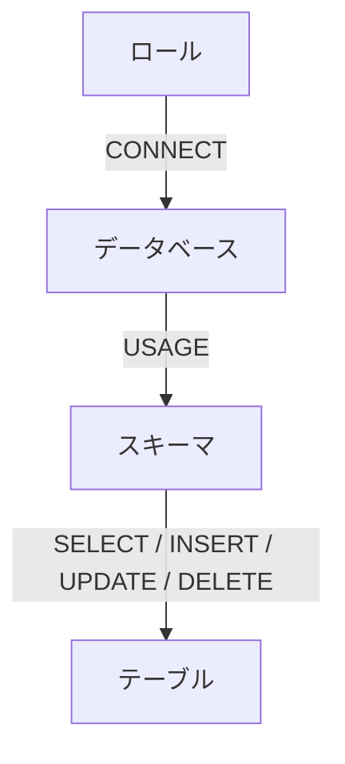

# 3-1. DCLの概要

## DCLとは

DCL（Data Control Language）は、データベースへの**アクセス権限を制御**するための言語です。
誰が・どのオブジェクトに対して・何の操作を行えるかを定義します。

| コマンド | 役割 |
| :--- | :--- |
| `GRANT` | 権限を付与する |
| `REVOKE` | 権限を取り消す |

---

## なぜアクセス制御が必要か

データベースには機密情報（個人情報・給与・売上など）が集中します。
適切なアクセス制御を行わないと、次のようなリスクが生じます。

- **情報漏洩**: 不要な権限を持つユーザーが機密データを閲覧・持ち出せてしまう
- **誤操作**: 開発者が誤って本番データを削除・更新してしまう
- **内部不正**: 権限が広すぎるユーザーが意図的にデータを改ざんする

:::note 最小権限の原則
「そのユーザーが業務を遂行するために必要な最低限の権限だけを付与する」という考え方です。
PostgreSQLの権限設計では、この原則を常に意識してください。
:::

---

## PostgreSQLの権限モデル

PostgreSQLでは権限を以下の2段階で管理します。

```
データベースへの接続権限
└── 各オブジェクト（スキーマ・テーブル等）への操作権限
```



接続できても、スキーマやテーブルへの権限がなければ操作はできません。
逆に言えば、テーブルの権限だけ与えてもスキーマへのUSAGEがなければアクセスできないため、
**段階的に権限を付与する**必要があります。

---

## 権限の対象となるオブジェクト

GRANTで操作できる主なオブジェクトは以下のとおりです。

| オブジェクト | 付与できる権限の例 |
| :--- | :--- |
| データベース | `CONNECT`, `CREATE`, `TEMP` |
| スキーマ | `USAGE`, `CREATE` |
| テーブル | `SELECT`, `INSERT`, `UPDATE`, `DELETE`, `TRUNCATE`, `REFERENCES` |
| シーケンス | `USAGE`, `SELECT`, `UPDATE` |
| 関数 | `EXECUTE` |
