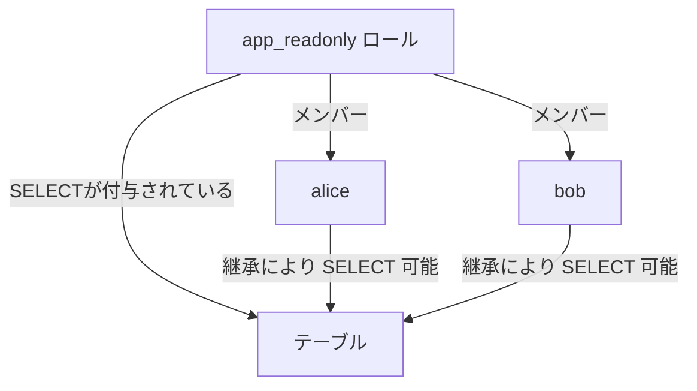

# 3-2. ロール

## ロールとは

PostgreSQLでは、**ユーザーとグループの両方を「ロール」という単一の概念で管理**します。
他のRDBMSではユーザーとグループが別概念として存在することがありますが、PostgreSQLではどちらもロールです。

| 従来の概念 | PostgreSQLでの扱い |
| :--- | :--- |
| ユーザー（ログイン可能な個人） | ログイン属性を持つロール |
| グループ（複数ユーザーの集まり） | ログイン属性を持たないロール |

---

## ロールの属性

ロールを作成するとき、以下の属性を指定できます。

| 属性 | 説明 |
| :--- | :--- |
| `LOGIN` / `NOLOGIN` | データベースへのログインを許可するか |
| `SUPERUSER` / `NOSUPERUSER` | すべての権限チェックをバイパスするスーパーユーザーにするか |
| `CREATEDB` / `NOCREATEDB` | データベースを作成できるか |
| `CREATEROLE` / `NOCREATEROLE` | 新しいロールを作成・変更・削除できるか |
| `INHERIT` / `NOINHERIT` | 所属するロールの権限を自動継承するか |
| `PASSWORD 'xxx'` | ログイン用パスワードの設定 |
| `CONNECTION LIMIT n` | 同時接続数の上限（`-1` で無制限） |

:::caution SUPERUSER の扱い
`SUPERUSER` はすべての権限チェックを飛ばすため、通常の業務用ユーザーには**絶対に付与しない**でください。
日常業務は最小権限のロールで行い、管理作業だけ `postgres` ユーザーで行う運用が一般的です。
:::

---

## ロールの継承

ロールは他のロールに**所属（MEMBER）**させることができます。
所属されたロール（親）の権限を、子ロールが引き継ぐ仕組みです。



`INHERIT`（デフォルト）が設定されていれば、alice・bob は `app_readonly` の権限を自動で使えます。
`NOINHERIT` の場合は `SET ROLE` で明示的に切り替える必要があります。

---

## システムカタログで確認する

```sql
-- ロール一覧を確認
SELECT rolname, rolsuper, rolcanlogin, rolcreatedb
FROM pg_roles;

-- ロールのメンバーシップを確認
SELECT r.rolname AS role, m.rolname AS member
FROM pg_auth_members am
JOIN pg_roles r ON am.roleid = r.oid
JOIN pg_roles m ON am.member  = m.oid;
```

`\du` メタコマンドでも簡易一覧が確認できます。
