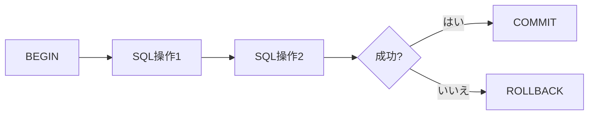

# 4-1. TCLの概要

## TCLとは

TCL（Transaction Control Language）は、**トランザクションの開始・確定・取り消し**を制御するための言語です。

| コマンド | 役割 |
| :--- | :--- |
| `BEGIN` | トランザクションを開始する |
| `COMMIT` | 変更を確定する |
| `ROLLBACK` | 変更を取り消す |
| `SAVEPOINT` | 途中にチェックポイントを作る |
| `RELEASE SAVEPOINT` | セーブポイントを解放する |
| `ROLLBACK TO SAVEPOINT` | セーブポイントまで戻す |

---

## トランザクションとは

**トランザクション**とは、「一連のSQL操作をひとまとまりとして扱う仕組み」です。
すべての操作が成功した場合のみ確定し、どれか一つでも失敗したら全部なかったことにできます。

### 銀行振込の例

```
A の口座から 10,000円 引く  ← SQL 1
B の口座に   10,000円 足す  ← SQL 2
```

SQL 1 が成功して SQL 2 が失敗した場合、10,000円が消えてしまいます。
トランザクションで囲めば、SQL 2 が失敗した時点で SQL 1 も自動的に取り消されます。

---

## ACID特性

トランザクションは以下の4つの性質（ACID）を保証します。

| 特性 | 英語 | 内容 |
| :--- | :--- | :--- |
| 原子性 | Atomicity | すべて成功するか、すべて失敗するか（中途半端な状態にならない） |
| 一貫性 | Consistency | トランザクション前後でデータの整合性が保たれる |
| 独立性 | Isolation | 他のトランザクションの途中結果が見えない |
| 永続性 | Durability | COMMITされたデータはシステム障害後も失われない |



---

## 自動コミットモード

PostgreSQLでは、`BEGIN` なしで実行したSQL文は**自動的に1文ごとのトランザクション**として扱われます（自動コミット）。

```sql
-- これは自動コミット（即座に確定される）
UPDATE employees SET salary = 500000 WHERE emp_id = 1;

-- これはトランザクション（COMMIT/ROLLBACKで制御できる）
BEGIN;
UPDATE employees SET salary = 500000 WHERE emp_id = 1;
COMMIT;
```

:::caution DDLもトランザクションで囲める
PostgreSQLの特徴として、`CREATE TABLE` や `ALTER TABLE` などのDDLもトランザクションで囲むことができます。
他のRDBMS（Oracleなど）ではDDLが自動COMMITされますが、PostgreSQLでは `ROLLBACK` で取り消せます。
:::
