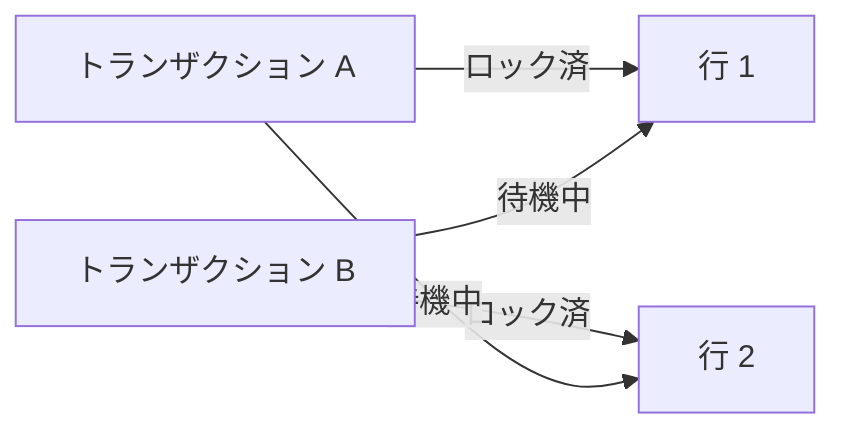

# 4-3. ロック

## ロックとは

複数のトランザクションが同じデータに同時アクセスしたとき、**データの整合性を保つための排他制御**がロックです。

---

## 行レベルロック

PostgreSQLは基本的に**行単位**でロックを取得します。
同じテーブルでも、異なる行を操作するトランザクションは互いにブロックしません。

### FOR UPDATE

`SELECT ... FOR UPDATE` は、取得した行を**更新するために予約（排他ロック）**します。
他のトランザクションが同じ行を `FOR UPDATE` しようとするとブロックされます。

```sql
BEGIN;

-- 行を取得しながらロック
SELECT * FROM accounts WHERE id = 1 FOR UPDATE;

-- この間、他のトランザクションが id=1 を FOR UPDATE しようとすると待機する

UPDATE accounts SET balance = balance - 10000 WHERE id = 1;

COMMIT;
-- ロック解放
```

### FOR SHARE

`SELECT ... FOR SHARE` は、取得した行を**他のトランザクションが更新できないように**します（共有ロック）。
読み取りは複数のトランザクションから同時に行えます。

```sql
SELECT * FROM inventory WHERE product_id = 5 FOR SHARE;
```

### NOWAIT / SKIP LOCKED

ロックが取得できなかったときの動作を指定できます。

```sql
-- ロック待機せずに即エラー
SELECT * FROM jobs WHERE status = 'pending' FOR UPDATE NOWAIT;

-- ロック中の行をスキップして次の行を取得（ジョブキューなどで活用）
SELECT * FROM jobs WHERE status = 'pending' FOR UPDATE SKIP LOCKED LIMIT 1;
```

---

## テーブルレベルロック

`LOCK TABLE` で明示的にテーブル全体をロックできます。
大規模なバッチ処理やスキーマ変更時に使います。

```sql
BEGIN;
LOCK TABLE employees IN EXCLUSIVE MODE;
-- 他のトランザクションはこのテーブルへの書き込みを待機する
COMMIT;
```

---

## デッドロック

2つのトランザクションが互いに相手のロックを待ち続ける状態を**デッドロック**と言います。

```
トランザクション A: 行1をロック → 行2を待機
トランザクション B: 行2をロック → 行1を待機
→ 永遠に解消されない
```



PostgreSQLはデッドロックを自動検出し、一方のトランザクションをエラーで終了させます。
アプリケーション側ではエラーをキャッチして `ROLLBACK` し、リトライするのが定石です。

:::tip デッドロックを防ぐには
複数の行を操作するとき、**常に同じ順序でロックを取得する**ことで発生確率を大幅に下げられます。
例：`id` の昇順に `FOR UPDATE` する、などのルールを決めておく。
:::

---

## ロック状況の確認

```sql
-- 現在のロック情報を確認
SELECT pid, relation::regclass, mode, granted
FROM pg_locks
WHERE relation IS NOT NULL;

-- ロック待ちが発生しているセッションを確認
SELECT pid, wait_event_type, wait_event, query
FROM pg_stat_activity
WHERE wait_event_type = 'Lock';
```
