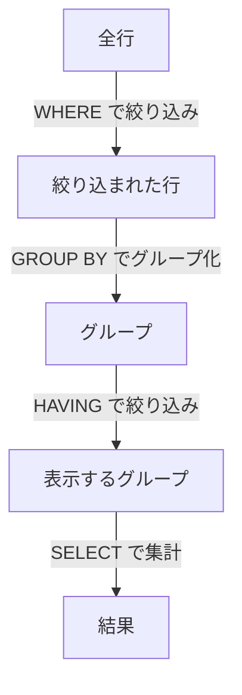

# 5-3. 絞り込みと集計

## WHERE句 — 行の絞り込み

### 比較演算子

```sql
-- 給与が50万以上
SELECT * FROM employees WHERE salary >= 500000;

-- 給与が30万より多く50万以下
SELECT * FROM employees WHERE salary > 300000 AND salary <= 500000;

-- 特定の社員以外
SELECT * FROM employees WHERE emp_id <> 1;
-- != でも同じ意味
SELECT * FROM employees WHERE emp_id != 1;
```

| 演算子 | 意味 |
| :---: | :--- |
| `=` | 等しい |
| `<>` / `!=` | 等しくない |
| `<` / `>` | より小さい / より大きい |
| `<=` / `>=` | 以下 / 以上 |

### 論理演算子（AND / OR / NOT）

```sql
-- 開発部（dept_id=1）かつ給与45万以上
SELECT * FROM employees
WHERE dept_id = 1 AND salary >= 450000;

-- 開発部または営業部
SELECT * FROM employees
WHERE dept_id = 1 OR dept_id = 2;

-- 開発部以外
SELECT * FROM employees
WHERE NOT dept_id = 1;
```

:::tip ANDとORの優先順位
`AND` は `OR` より先に評価されます。意図した絞り込みにするため、`OR` を含む場合は括弧を使いましょう。

```sql
-- NG: dept_id=1 AND salary>=450000 の結果 OR dept_id=2 と評価される
WHERE dept_id = 1 AND salary >= 450000 OR dept_id = 2

-- OK: 開発部または営業部で、かつ給与45万以上
WHERE (dept_id = 1 OR dept_id = 2) AND salary >= 450000
```
:::

### IN / NOT IN — 複数値との一致

```sql
-- dept_id が 1 または 2 の社員
SELECT * FROM employees WHERE dept_id IN (1, 2);

-- dept_id が 1 でも 2 でもない社員
SELECT * FROM employees WHERE dept_id NOT IN (1, 2);
```

### BETWEEN — 範囲指定

```sql
-- 給与が40万〜50万の社員（両端を含む）
SELECT * FROM employees WHERE salary BETWEEN 400000 AND 500000;

-- 2020年〜2022年入社
SELECT * FROM employees
WHERE hired_at BETWEEN '2020-01-01' AND '2022-12-31';
```

### LIKE — パターンマッチ

```sql
-- 名前が「田」で始まる社員
SELECT * FROM employees WHERE emp_name LIKE '田%';

-- 名前に「子」を含む社員
SELECT * FROM employees WHERE emp_name LIKE '%子%';

-- 「田中 ○郎」のように3文字目が特定の文字
SELECT * FROM employees WHERE emp_name LIKE '田中 _郎';
```

| ワイルドカード | 意味 |
| :---: | :--- |
| `%` | 0文字以上の任意の文字列 |
| `_` | 任意の1文字 |

大文字・小文字を区別しない場合は `ILIKE` を使います。

```sql
SELECT * FROM employees WHERE emp_name ILIKE '%たなか%';
```

### IS NULL / IS NOT NULL

NULL は「値が不明・未設定」を表す特殊な状態です。
`= NULL` ではなく `IS NULL` を使います。

```sql
-- 部署が未設定の社員
SELECT * FROM employees WHERE dept_id IS NULL;

-- 部署が設定されている社員
SELECT * FROM employees WHERE dept_id IS NOT NULL;
```

:::caution NULL との比較に = は使えない
```sql
-- NG: この条件は常に FALSE（NULL = NULL は FALSE）
WHERE dept_id = NULL

-- OK
WHERE dept_id IS NULL
```
:::

---

## ORDER BY — 並び替え

```sql
-- 給与の高い順
SELECT * FROM employees ORDER BY salary DESC;

-- 入社日の古い順
SELECT * FROM employees ORDER BY hired_at ASC;

-- 複数列で並び替え（dept_id 昇順、同一部署内は給与降順）
SELECT * FROM employees ORDER BY dept_id ASC, salary DESC;
```

`ASC`（昇順）はデフォルトなので省略可能です。

### NULLの並び順

デフォルトでは、`DESC` のとき NULL は先頭、`ASC` のとき NULL は末尾に来ます。

```sql
-- NULLを末尾に（昇順でも明示的に後ろへ）
SELECT * FROM employees ORDER BY dept_id ASC NULLS LAST;

-- NULLを先頭に
SELECT * FROM employees ORDER BY dept_id DESC NULLS FIRST;
```

---

## LIMIT / OFFSET — 件数制限とページング

```sql
-- 上位5件だけ取得
SELECT * FROM employees ORDER BY salary DESC LIMIT 5;

-- 6件目〜10件目を取得（ページング）
SELECT * FROM employees ORDER BY emp_id LIMIT 5 OFFSET 5;
```

`OFFSET n` は先頭 n 行をスキップします。

:::tip ページング実装時の注意
`OFFSET` が大きくなるほど内部で読み飛ばす処理が増え、パフォーマンスが低下します。
大量データのページングには、前ページ最後の ID をキーにする「カーソルページング」が推奨されます。
:::

---

## 集計関数

行の値を集計して1つの結果を返します。

| 関数 | 内容 |
| :--- | :--- |
| `COUNT(*)` | 行数を数える（NULLも含む） |
| `COUNT(列)` | NULL以外の行数を数える |
| `SUM(列)` | 合計値 |
| `AVG(列)` | 平均値 |
| `MAX(列)` | 最大値 |
| `MIN(列)` | 最小値 |

```sql
-- 社員の総数
SELECT COUNT(*) FROM employees;

-- 部署が設定されている社員の数
SELECT COUNT(dept_id) FROM employees;

-- 給与の合計・平均・最大・最小
SELECT
    SUM(salary)  AS 合計,
    AVG(salary)  AS 平均,
    MAX(salary)  AS 最大,
    MIN(salary)  AS 最小
FROM employees;
```

:::note AVG と NULL
`AVG` は NULL を無視して計算します。
NULL を 0 として扱いたい場合は `COALESCE` で変換します。
```sql
SELECT AVG(COALESCE(salary, 0)) FROM employees;
```
:::

---

## GROUP BY — グループ集計

列の値でグループを作り、グループごとに集計します。

```sql
-- 部署ごとの社員数と平均給与
SELECT
    dept_id,
    COUNT(*)     AS 人数,
    AVG(salary)  AS 平均給与
FROM employees
GROUP BY dept_id;
```

`SELECT` に書ける列は、**GROUP BY に指定した列** か **集計関数** のみです。

```sql
-- NG: emp_name は GROUP BY に含まれていない
SELECT dept_id, emp_name, COUNT(*) FROM employees GROUP BY dept_id;

-- OK
SELECT dept_id, COUNT(*) FROM employees GROUP BY dept_id;
```

### HAVING — グループの絞り込み

`WHERE` は集計前の行を絞り込み、`HAVING` は集計後のグループを絞り込みます。

```sql
-- 社員数が2人以上の部署だけ表示
SELECT
    dept_id,
    COUNT(*) AS 人数
FROM employees
GROUP BY dept_id
HAVING COUNT(*) >= 2;

-- 平均給与が45万以上の部署
SELECT
    dept_id,
    AVG(salary) AS 平均給与
FROM employees
GROUP BY dept_id
HAVING AVG(salary) >= 450000;
```



---

## CASE式 — 条件分岐

SELECTの中で条件分岐を行い、値を変換できます。

```sql
-- 給与水準をラベル化
SELECT
    emp_name,
    salary,
    CASE
        WHEN salary >= 500000 THEN 'S'
        WHEN salary >= 450000 THEN 'A'
        WHEN salary >= 400000 THEN 'B'
        ELSE 'C'
    END AS grade
FROM employees;
```

集計関数と組み合わせて条件付き集計もできます。

```sql
-- 部署ごとに給与50万以上の社員数を集計
SELECT
    dept_id,
    COUNT(*) FILTER (WHERE salary >= 500000) AS 高給与人数,
    COUNT(*)                                 AS 総人数
FROM employees
GROUP BY dept_id;
```

`FILTER (WHERE ...)` は、集計関数に条件を付けるPostgreSQL独自の書き方です（CASE より簡潔）。

---

## 演習問題

この章の内容を実際に手を動かして確認しましょう。

→ [DML基礎演習](../exercises/04_dml_basic.md)
