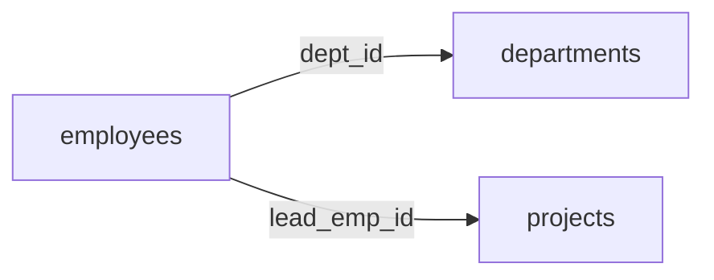

# 6-1. DML応用の概要

## 本章で学ぶこと

前章では1つのテーブルに対する基本的な操作を学びました。
本章では**複数テーブルをまたいだ操作**や、**複雑な条件を表現する技法**を学びます。

| 機能 | 概要 | 対応節 |
| :--- | :--- | :--- |
| **JOIN（結合）** | 複数テーブルを列方向に結合する | 6-2 |
| **集合演算** | 複数SELECTの結果を行方向に合成・差し引きする | 6-3 |
| **サブクエリ** | SELECT文の中に別のSELECT文を埋め込む | 6-4 |
| **WITH句（CTE）** | サブクエリに名前を付けて再利用・再帰処理する | 6-5 |
| **ウィンドウ関数** | グループ集計しつつ個々の行も保持する | 6-6 |

---

## なぜこれらが重要か

実務のデータは複数テーブルに分散して格納されています。
たとえば「社員名・部署名・担当プロジェクト名を一覧で見たい」という要求は、
`employees`・`departments`・`projects` の3テーブルを組み合わせないと実現できません。

本章の技術を習得することで、**どんな複雑なデータ要求にも対応できる**SQLが書けるようになります。

---

## 本章で使うデータ（再掲）

前章で作成したテーブルとデータを引き続き使用します。

| テーブル | 件数 | 備考 |
| :--- | :--- | :--- |
| `departments` | 5件 | 開発部・営業部・人事部・経理部・マーケティング部 |
| `employees` | 20件 | 1件は dept_id が NULL |
| `projects` | 6件 | 1件はリーダー未設定（lead_emp_id が NULL） |
