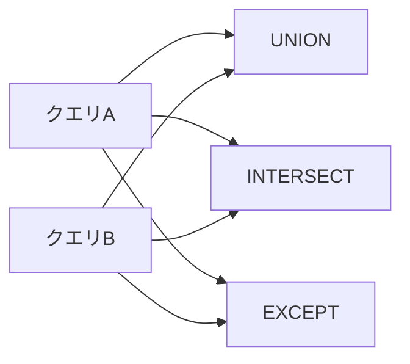

# 6-3. 集合演算

## 集合演算とは

複数の `SELECT` 結果を**行方向に合成・差し引き**する操作です。
JOINが「列を横につなぐ」のに対し、集合演算は「行を縦に合成する」イメージです。

| 演算子 | 意味 |
| :--- | :--- |
| `UNION` | 和集合（重複行を除く） |
| `UNION ALL` | 和集合（重複行を残す） |
| `INTERSECT` | 積集合（両方に存在する行） |
| `INTERSECT ALL` | 積集合（重複行を残す） |
| `EXCEPT` | 差集合（左にあって右にない行） |
| `EXCEPT ALL` | 差集合（重複行を残す） |

:::note 使用条件
集合演算を使うには、各 `SELECT` の**列数・列の型**が一致している必要があります。
列名は先頭の `SELECT` のものが採用されます。
:::

---

## UNION — 和集合

2つのクエリ結果を縦に結合し、**重複行を自動で除去**します。

```sql
-- 開発部の社員
SELECT emp_name, dept_id FROM employees WHERE dept_id = 1
UNION
-- 給与50万以上の社員
SELECT emp_name, dept_id FROM employees WHERE salary >= 500000;
```

両条件を満たす社員（開発部かつ給与50万以上）は**1行だけ**表示されます。

### UNION ALL — 重複を残す

```sql
SELECT emp_name FROM employees WHERE dept_id = 1
UNION ALL
SELECT emp_name FROM employees WHERE salary >= 500000;
```

重複排除の処理がない分、`UNION` より**高速**です。
重複が存在しないことが分かっている場合や、重複を意図的に残したい場合は `UNION ALL` を使います。

---

## INTERSECT — 積集合

**両方のクエリ結果に存在する行**だけを返します。

```sql
-- 開発部の社員 AND 給与45万以上の社員
SELECT emp_name FROM employees WHERE dept_id = 1
INTERSECT
SELECT emp_name FROM employees WHERE salary >= 450000;
```

`AND` 条件で書き換えられることが多いですが、列が複数あって複雑な場合に有用です。

---

## EXCEPT — 差集合

**左のクエリ結果にあって、右のクエリ結果にない行**を返します。

```sql
-- 全社員のうち、プロジェクトリーダーでない社員を探す
SELECT emp_id FROM employees
EXCEPT
SELECT lead_emp_id FROM projects WHERE lead_emp_id IS NOT NULL;
```

「〇〇に含まれない」という否定条件を表現するのに便利です。
`NOT IN` や `NOT EXISTS` でも同じ結果を得られますが、`EXCEPT` の方が読みやすいケースがあります。

---

## ORDER BY と LIMIT の適用

集合演算全体の結果に対して `ORDER BY` や `LIMIT` を適用する場合は、**末尾に一度だけ**書きます。

```sql
SELECT emp_name, salary FROM employees WHERE dept_id = 1
UNION ALL
SELECT emp_name, salary FROM employees WHERE dept_id = 2
ORDER BY salary DESC
LIMIT 5;
```

個々の `SELECT` に `ORDER BY` を付けることは（サブクエリでない限り）できません。

---

## 使い分けのまとめ

| やりたいこと | 使う演算子 |
| :--- | :--- |
| AまたはB（重複なし） | `UNION` |
| AまたはB（重複あり・高速） | `UNION ALL` |
| AかつB | `INTERSECT` |
| AにあってBにない | `EXCEPT` |


