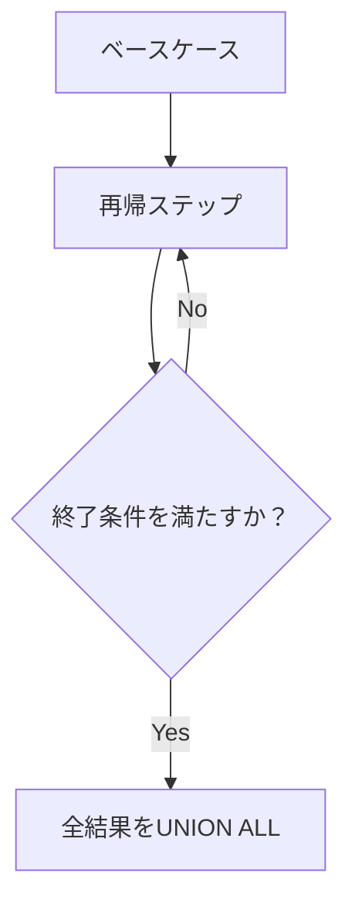

# 6-5. WITH句（CTE）

## CTEとは

CTE（Common Table Expression）は、`WITH` キーワードを使って**サブクエリに名前を付け**、メインクエリから参照できるようにする機能です。

```sql
WITH cte名 AS (
    SELECT ...
)
SELECT * FROM cte名;
```

「一時的な名前付きクエリ」と考えると分かりやすいです。

---

## なぜCTEを使うのか

### サブクエリのネストを解消する

```sql
-- サブクエリのネストで書いた場合（読みにくい）
SELECT emp_name
FROM (
    SELECT emp_name, salary,
           AVG(salary) OVER (PARTITION BY dept_id) AS dept_avg
    FROM employees
) AS sub
WHERE salary > dept_avg;

-- CTEで書いた場合（各ステップが明確）
WITH dept_avg_cte AS (
    SELECT emp_name, salary,
           AVG(salary) OVER (PARTITION BY dept_id) AS dept_avg
    FROM employees
)
SELECT emp_name
FROM dept_avg_cte
WHERE salary > dept_avg;
```

### 同じサブクエリを複数回参照する

サブクエリでは同じ内容を何度も書く必要がありますが、CTEなら一度定義すれば何度でも参照できます。

---

## 基本的な使い方

```sql
-- 部署ごとの平均給与を計算し、平均より高い社員を抽出
WITH dept_stats AS (
    SELECT
        dept_id,
        AVG(salary) AS avg_salary
    FROM employees
    GROUP BY dept_id
)
SELECT
    e.emp_name,
    e.salary,
    ds.avg_salary
FROM employees AS e
JOIN dept_stats AS ds ON e.dept_id = ds.dept_id
WHERE e.salary > ds.avg_salary
ORDER BY e.dept_id, e.salary DESC;
```

---

## 複数のCTEを連鎖させる

`,` で区切って複数のCTEを定義できます。後に定義したCTEは前のCTEを参照できます。

```sql
WITH
-- ステップ1: 部署ごとの集計
dept_stats AS (
    SELECT
        dept_id,
        COUNT(*)    AS headcount,
        AVG(salary) AS avg_salary,
        MAX(salary) AS max_salary
    FROM employees
    WHERE dept_id IS NOT NULL
    GROUP BY dept_id
),
-- ステップ2: 集計結果に部署名を付ける
dept_report AS (
    SELECT
        d.dept_name,
        ds.headcount,
        ROUND(ds.avg_salary) AS avg_salary,
        ds.max_salary
    FROM dept_stats AS ds
    JOIN departments AS d ON ds.dept_id = d.dept_id
)
-- メインクエリ: 人数の多い順に表示
SELECT *
FROM dept_report
ORDER BY headcount DESC;
```

複雑なロジックを小さなステップに分割できるため、**デバッグや保守が容易**になります。

---

## 更新系DMLとのCTE

CTEは `SELECT` だけでなく、`INSERT` / `UPDATE` / `DELETE` と組み合わせることもできます。

```sql
-- 削除した行の情報を記録しながら削除する
WITH deleted AS (
    DELETE FROM employees
    WHERE hired_at < '2020-01-01'
    RETURNING emp_id, emp_name, hired_at
)
INSERT INTO employees_archive
SELECT emp_id, emp_name, hired_at, NOW() AS archived_at
FROM deleted;
```

削除と同時にアーカイブテーブルへの挿入を1つのSQL文で実現しています。

---

## 再帰CTE

`WITH RECURSIVE` を使うと、自己参照する再帰クエリが書けます。
**階層構造（ツリー）のデータ**を扱うのに特に有用です。

### 例：1から10までの連番を生成する

```sql
WITH RECURSIVE counter AS (
    -- ベースケース（再帰の起点）
    SELECT 1 AS n
    UNION ALL
    -- 再帰ステップ（終了条件まで繰り返す）
    SELECT n + 1
    FROM counter
    WHERE n < 10
)
SELECT n FROM counter;
```

### 例：組織の上下関係（上司→部下）を辿る

```sql
-- 社員テーブルに上司IDがある場合の例
CREATE TABLE org (
    emp_id    INTEGER PRIMARY KEY,
    emp_name  VARCHAR(50),
    manager_id INTEGER REFERENCES org(emp_id)
);

WITH RECURSIVE org_tree AS (
    -- ベースケース：トップ（上司なし）から始める
    SELECT emp_id, emp_name, manager_id, 0 AS depth
    FROM org
    WHERE manager_id IS NULL

    UNION ALL

    -- 再帰ステップ：部下を辿る
    SELECT o.emp_id, o.emp_name, o.manager_id, ot.depth + 1
    FROM org AS o
    JOIN org_tree AS ot ON o.manager_id = ot.emp_id
)
SELECT
    REPEAT('  ', depth) || emp_name AS hierarchy,  -- インデントで階層を表現
    depth
FROM org_tree
ORDER BY depth, emp_id;
```



:::caution 無限ループに注意
再帰CTEは終了条件（`WHERE`句）がないと無限に繰り返します。
`WHERE n < 1000` のような上限や、PostgreSQLの設定パラメータ `max_recursion` で制限できます。
:::
