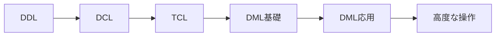

# 7-1. 高度な操作の概要

## 本章で学ぶこと

本章では、実務でデータ量や複雑さが増してきたときに必要になる、PostgreSQL固有の高度な機能を学びます。

| 機能 | 概要 | 対応節 |
| :--- | :--- | :--- |
| **高度なDB機能** | パーティショニング・マテリアライズドビュー・高度なインデックス | 7-2 |
| **PL/pgSQL** | データベース内で動くプログラム（関数・プロシージャ・トリガー） | 7-3 |

---

## これまでの振り返り

SQLの基礎から応用を経て、ここでは**パフォーマンス・保守性・自動化**に焦点を当てます。
