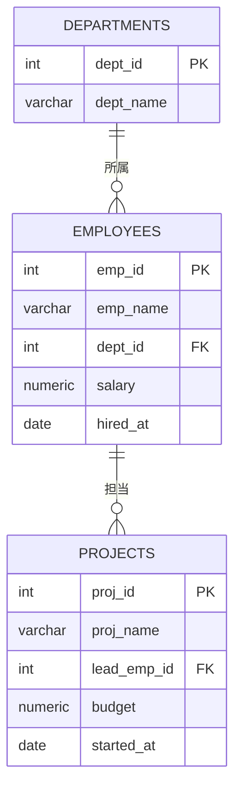

# 演習のはじめに

## 演習の進め方

各演習は教科書編の章に対応しています。
対応する章を読んでから演習に取り組むと、より効果的に学習できます。

| 演習ファイル | 対応する章 |
| :--- | :--- |
| [DDL演習](./01_ddl.md) | [2章 DDL](../02_ddl/01_overview.md) |
| [DCL演習](./02_dcl.md) | [3章 DCL](../03_dcl/01_overview.md) |
| [TCL演習](./03_tcl.md) | [4章 TCL](../04_tcl/01_overview.md) |
| [DML基礎演習](./04_dml_basic.md) | [5章 DML基礎](../05_dml_basic/01_overview.md) |
| [DML応用演習](./05_dml_advanced.md) | [6章 DML応用](../06_dml_advanced/01_overview.md) |
| [高度な操作演習](./06_advanced/01_constraints.md) | [7章 高度な操作](../07_advanced/01_overview.md) |

---

## 使用するテーブル

全演習を通じて、以下の3テーブルを使用します。

---

## ヒント

詰まったときはヒントを参照してください。まず自分で考えてから使いましょう。

- [ヒント集](./hints.md)
