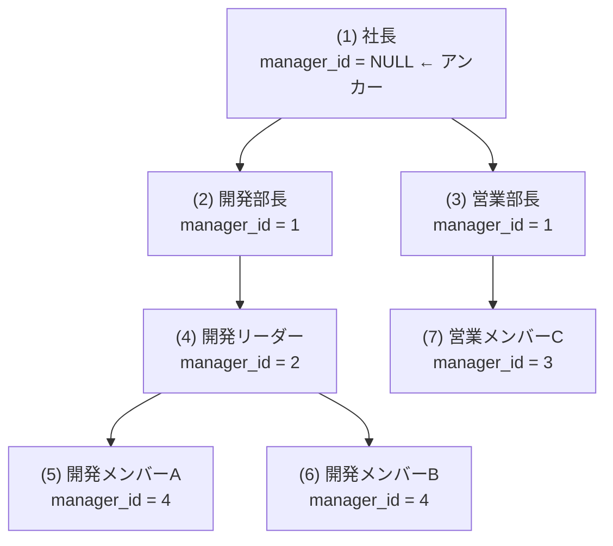

# ヒント集

詰まったときはここを確認してください。

---

## DDL演習

**問題1（テーブル作成）**
- `SERIAL` は自動連番の整数型です
- タイムゾーンあり日時は `TIMESTAMPTZ`、デフォルト値は `DEFAULT NOW()` で設定します

**問題3（制約の追加）**
- `ALTER TABLE ... ADD CONSTRAINT ... CHECK (...)` で制約を追加できます
- 一意制約は `ADD CONSTRAINT ... UNIQUE (列名)` です

**問題4（ALTER TABLE）**
- NOT NULL を追加する前に、既存行のNULLを埋めないとエラーになります
- `UPDATE employees SET email = 'dummy@example.com' WHERE email IS NULL;` で埋めてから追加しましょう

**問題5（インデックス設計）**
- 関数を使った検索には `CREATE INDEX ... ON テーブル名 (関数名(列名))` の形式を使います
- 特定の条件でしか使わないインデックスには `WHERE` 句を付けた部分インデックスを検討しましょう

**問題6（ビュー）**
- NULL を別の値に変換するには `COALESCE(列名, 'デフォルト値')` を使います
- ビューに対してもWHERE句で絞り込みができます

---

## DCL演習

**問題1（ロール作成）**
- `NOLOGIN` 属性のロールはグループとして使います
- `CONNECTION LIMIT n` で同時接続数を制限できます

**問題4（読み取り専用ユーザー）**
- `ALTER DEFAULT PRIVILEGES` を使うと将来のテーブルにも自動で権限が付与されます
- スキーマへの `USAGE` がないと、テーブル権限があってもアクセスできません

**問題5（ロール設計）**
- 人ではなく役割にロールを付与し、人はロールに追加する設計にすると管理が楽になります
- `GRANT ロール名 TO ユーザー名` でロールにメンバーを追加できます

---

## TCL演習

**問題1（COMMIT/ROLLBACK）**
- `BEGIN` ～ `COMMIT/ROLLBACK` の間の変更は、COMMITするまで同じセッション内でしか見えません
- デフォルトの分離レベル（READ COMMITTED）では、他のセッションには未COMMITのデータは見えません

**問題2（SAVEPOINT）**
```sql
BEGIN;
UPDATE employees SET salary = salary * 1.05 WHERE dept_id = 1;
SAVEPOINT sp_all_5pct;
-- 間違えた場合:
ROLLBACK TO SAVEPOINT sp_all_5pct;
-- 再度UPDATEして正しい値に修正
COMMIT;
```

**問題3（デッドロック）**
- デッドロックを防ぐには、複数行を操作する順序を全セッションで統一します
- `emp_id` の昇順でロックを取得するようにSQLを書き換えましょう

**問題5（FOR UPDATE）**
```sql
BEGIN;
SELECT stock FROM inventory WHERE product_id = ? FOR UPDATE;
-- stock > 0 をアプリ側またはIF文で確認してからUPDATE
UPDATE inventory SET stock = stock - 1 WHERE product_id = ?;
COMMIT;
```

---

## DML基礎演習

**問題4（UPDATE/DELETE）**
- UPDATEやDELETEの前に必ず `SELECT` で対象行を確認しましょう
- `RETURNING` 句を使うと変更後の値を確認できます

**問題5（集計）**
- 入社年の抽出には `EXTRACT(YEAR FROM hired_at)` または `DATE_PART('year', hired_at)` を使います
- `GROUP BY` に同じ式を書く必要があります

**問題6（CASE式）**
- `FILTER (WHERE ...)` は `COUNT(*) FILTER (WHERE salary >= 500000)` のように書きます
- CASE式でも同様の集計が書けます（`COUNT(CASE WHEN salary >= 500000 THEN 1 END)`）

**問題7（UPSERT）**
- `ON CONFLICT (列名) DO UPDATE SET ...` の形式で書きます
- 挿入しようとした値は `EXCLUDED.列名` で参照できます

---

## DML応用演習

**問題2（LEFT JOIN + COALESCE）**
- `COALESCE(d.dept_name, '未所属')` で NULL を置き換えられます
- LEFT JOIN後に右側がNULLになる行は、`WHERE` で `IS NULL` を使って抽出できます

**問題4（JOINを使った集計）**
- 社員がいない部署を含めるには `departments` を起点にして `employees` に LEFT JOIN します
- プロジェクト数は `projects` テーブルに対して別途LEFT JOINして COUNT します

**問題9（EXISTS）**
- `EXISTS (SELECT 1 FROM ...)` の `SELECT 1` は「何でもいい」という意味です
- `NOT EXISTS` は NULL に対して安全なため `NOT IN` より推奨されます

**問題11（サブクエリでグループ内TOP1）**
- FROM句のサブクエリで部署ごとの最大給与を求め、それとJOINします
- `WHERE salary = (SELECT MAX(salary) FROM employees AS e2 WHERE e2.dept_id = e.dept_id)` のような相関サブクエリでも実現できます

**問題13（再帰CTE）**
- ベースケースは `SELECT 1`、再帰ステップは `SELECT n * 2 FROM ... WHERE n < 512`
- 終了条件を忘れると無限ループになるので注意

**問題15（グループ内上位N名）**
- `RANK() OVER (PARTITION BY dept_id ORDER BY salary DESC) AS rnk` でグループ内順位を付けます
- CTEでrankを付けてから `WHERE rnk <= 2` で絞り込みます

**問題16（累計・LAG）**
- `SUM(salary) OVER (ORDER BY hired_at)` で累積合計
- `LAG(salary) OVER (ORDER BY hired_at)` で前の行の値
- 差額は `salary - LAG(salary) OVER (ORDER BY hired_at)` で計算できます

---

## 高度な操作演習1

**問題2（インデックス効果確認）**
- `EXPLAIN ANALYZE` の `Seq Scan` → `Index Scan` の変化を確認します
- テーブルの行数が少ないとPostgreSQLがSeq Scanを選ぶことがあります（統計情報の問題）
- `SET enable_seqscan = off;` で強制的にインデックスを使わせることができます（テスト用）

**問題4（GENERATED列）**
- `GENERATED ALWAYS AS (式) STORED` の形式で定義します
- STORED を指定すると物理的に保存されます（VIRTUAL は PostgreSQL では未サポート）

---

## 高度な操作演習2

**問題1（RANGEパーティション）**
- 子テーブルの `FOR VALUES FROM ... TO ...` は半開区間（FROM以上、TO未満）です
- 挿入後に子テーブルに直接SELECTして確認できます

**問題3（マテリアライズドビュー）**
- `REFRESH MATERIALIZED VIEW ビュー名;` でリフレッシュします
- `CONCURRENTLY` オプションはインデックスが必要です

---

## 高度な操作演習3

**問題3（ロック確認）**
- `pg_locks` と `pg_stat_activity` を `pid` で結合します
- `granted = false` の行がロック待ちの状態です

---

## PL/pgSQL演習

**問題2（関数）**
- `SELECT ... INTO 変数名` でクエリ結果を変数に格納します
- 行が見つからなかった場合は `NOT FOUND` が `TRUE` になります

**問題3（テーブルを返す関数）**
- `RETURNS TABLE(列名 型, ...)` で複数列を返す関数を定義します
- `CREATE OR REPLACE FUNCTION` では**戻り値の型（列構成）は変更できません**。戻り値を変えたい場合は先に `DROP FUNCTION 関数名(引数型);` で削除してから再作成してください
  ```sql
  -- 戻り値の型を変えたいとき
  DROP FUNCTION get_top_earners(INTEGER);
  CREATE FUNCTION get_top_earners(n INTEGER) RETURNS TABLE(...) ...;
  ```

**問題4（トリガー）**
- トリガー関数は `RETURNS TRIGGER` と宣言します
- `BEFORE UPDATE` トリガーでは `NEW` を返す必要があります

**問題5（変更履歴トリガー）**
- `TG_OP` で実行された操作の種類（`'INSERT'` / `'UPDATE'` / `'DELETE'`）を確認できます
- `current_user` は現在ログインしているロール名を返します

**問題6（プロシージャ）**
- `RAISE EXCEPTION 'メッセージ'` で例外を発生させてROLLBACKできます
- 更新した行数は `GET DIAGNOSTICS count = ROW_COUNT;` で取得できます

---

## 総合演習1

**問題3（分析クエリ）**
- 複数のCTEを組み合わせて段階的に集計します
- 各部署の最高給与者は `FIRST_VALUE` や相関サブクエリで取得できます

---

## 総合演習2

**問題1（クエリリファクタリング）**
- ネストしたサブクエリはCTEやJOINで書き直せることが多いです
- 同じ条件が複数回出てくる場合はCTEでまとめましょう

**問題3（再帰CTEで組織ツリー）**

`manager_id IS NULL` の行がツリーの**起点**（アンカー）です。INSERTしたデータは以下の階層構造になっています。



再帰CTEはこの構造を**上から順にたどる**ことで全行を取得します。

- `REPEAT('  ', depth)` でdepthの数だけスペースを繰り返してインデントを表現できます
- `depth` を0から始め、再帰ステップで `depth + 1` としてインクリメントします

**問題5（トランザクション設計）**
- プロシージャ内で `EXCEPTION` ブロックを使うと、エラー発生時に `ROLLBACK` できます
- 昇給が発生したかどうかは `IF new_salary > old_salary THEN` で判定します
