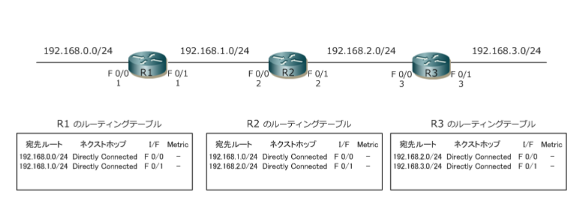
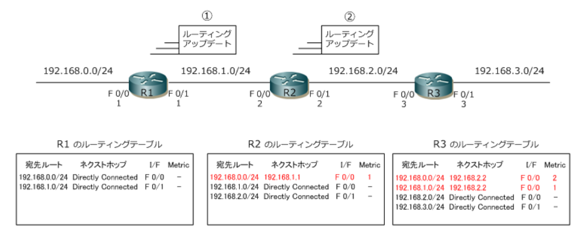
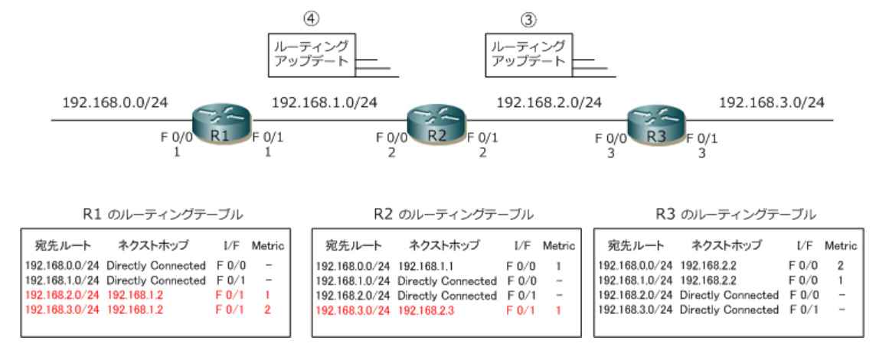
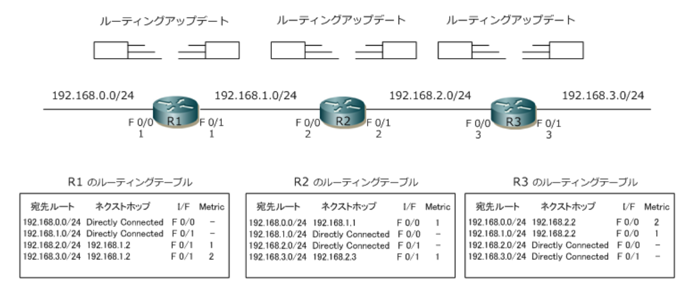
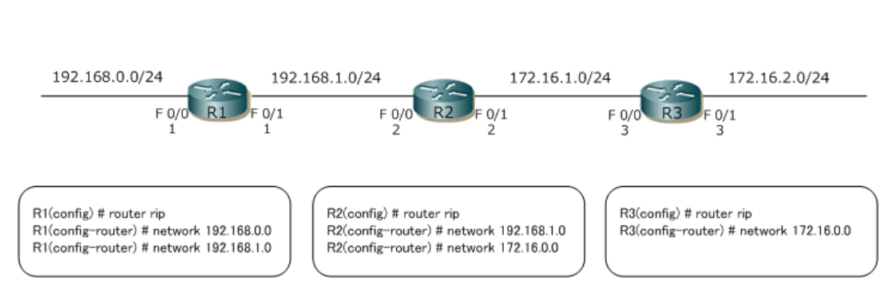
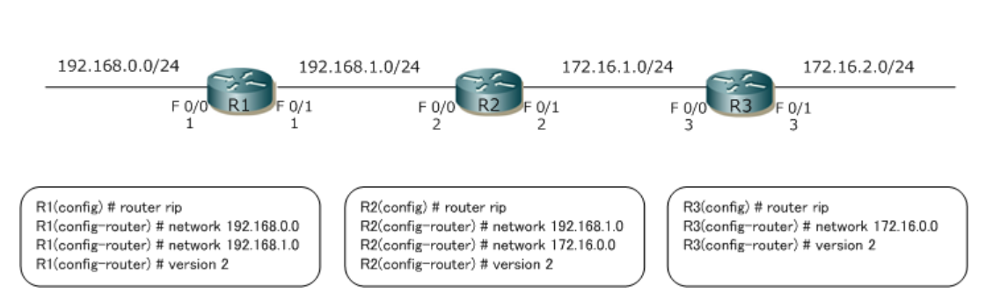

# RIP

## 概要解説

ディスタンスベクタ型のルーティングプロトコルであるRIPについて解説します。  
RIPの特徴は以下の通りです。  

RIPには**RIPv1**と**RIPv2**の2つがありますが以下の特徴はこれらに共通する内容です。


| 項目 | RIP (RIPv1 / RIPv2) の特徴 |
|---|---|
| ルーティングプロトコルのタイプ | ディスタンスベクタ型。距離 (distance) と方向 (vector) を基準に最適ルートを決定。 |
| メトリック | ホップ数 (経由するルータの数)。 |
| ルーティングのアップデート方法 | 定期的 (30秒) にテーブル全体を隣接ルータに通知。 |
| クラスフル or クラスレス | RIPv1はクラスフルーティング、RIPv2はクラスレスルーティングを行う。 |

RIPv1とRIPv2の違いは以下の通りです。大きな違いはクラスフルなのかクラスレスなのかという点です。


| 項目 | RIPv1 | RIPv2 |
|---|---|---|
| アップデートの通知方法 | ブロードキャスト (255.255.255.255) | マルチキャスト (224.0.0.9) |
| クラスフル or クラスレス | クラスフル | クラスレス |
| 経路集約 | 自動経路集約のみ | 自動経路集約、手動経路集約のどちらでも可能 |


### ディスタンスベクタ型ルーティングプロトコルの動作
ディスタンスベクタは、ディスタンス(**距離**)とベクタ(**方向**)により最適なルートを決定するアルゴリズム。  
簡単にいえば**ホップ数で最適なルート**を決定します。  

ルータ間では定期的にルーティングテーブル全体を交換し合うことでリモートネットワークの経路情報を受信します。  
**単純な動作であり収束が遅い**のが特徴。
ディスタンスベクタ型ルーティングプロトコルにはRIPとIGRPがあります。  
IGRPは現在使用されてません。


### ルーティングテーブルの形成
ディスタンスベクタ型のルーティングの動作を見ていきます。  
下図は全てのルータでRIPを有効にしていない状態です。  
全てのルータは自身のインターフェースのネットワークを経路情報として持っています。

**RIPを有効にしていない状態**



下図は全てのルータでRIPを起動した状態。  
RIPを起動したルータは隣接ルータにルーティングアップデートを送信します。  

今回は理解しやすくするために、R1→R2→R3の順番にルーティングアップデートを送信してその後、R3→R2→R1の順番で送信する前提で解説します。  
実際には、各ルータはRIPが有効になった時点で順番なしに両方のI/Fから一方的にルーティングアップデートを送信していき、ルーティングテーブルが形成。

1. R1は自身のルーティングテーブルの経路情報にメトリック値を [ 1 ] 加算し、ルーティングアップデートを送信。  
それを受信したR2は、自身のルーティングテーブルには存在しない「192.168.0.0/24」の経路を受信したメトリック値どおりに[ 1 ]としてルーティングテーブルに登録します。メトリックはホップ数のこと。

2. R2は自身のルーティングテーブルの経路情報にメトリック値を [ 1 ] 加算し、ルーティングアップデートを送信。  
[ 192.168.0.0/24 ] の経路情報はメトリック値が 1 となっており、1を加算した結果の [ 2 ] としてR3に送信します。  
それを受信したR3は、ルーティングテーブルには存在しない [ 192.168.0.0/24 ] の経路をメトリック値 2 として、[ 192.168.1.0/24 ] の経路をメトリック値に 1 としてルーティングテーブルに登録。

**RIPを有効にした状態**



3. R3→R2にルーティングアップデートを送信します。  
①、②と考え方は同じです。  
結果は下図の通りです。
4. R2→R1にルーティングアップデートを送信します。  
①、②と考え方は同じです。  
結果は下図の通りです。



### ルーティングテーブルの維持

各ルータのルーティングアップデートでルーティングテーブルが最終形として形成された後も、各ルータではネットワークの状態に変化がなくても、定期的にルーティングアップデートを送信します。  
この動作によってルーティングテーブルの経路情報が常に最新であるのかどうかを確認できて、完全な状態が維持されます。



## コマンド解説

### RIPの起動設定


RIPを起動させるためには、グローバルコンフィグレーションモードで以下のコマンドを入力します。

```bash
Cisco(config) # router rip
Cisco(config-router) #
```

RIPを有効にしたいインターフェースをIPアドレスで指定します。  
IPアドレスで指定する際には、そのI/FのIPアドレスをクラスフルアドレスとして指定します。  
例えば、RIPを有効にしたいI/FのIPが`192.168.1.254`の場合は **[ 192.168.1.0 ]** として指定、**[ 172.16.10.254 ]** の場合は「**172.16.0.0**」 としてクラスフルに指定。  
構文は [ network クラスフルアドレス ]。以下はR1の [ F0/0 ] と [ F0/1 ] のI/Fを有効にするため設定です。

```bash
Cisco(config-router) # network 192.168.0.0
Cisco(config-router) # network 192.168.1.0
```

基本的な設定はこの2つだけです。  
これだけでCiscoルータでRIPv1が起動しダイナミックルートがルータ間でやりとりされます。  
R3ではnetworkコマンドで定義したのは1行だけですが、R3のF0/0の[ **172.16.1.3** ]とF0/1の[ **172.16.2.3** ]のクラスフルアドレスは同じ [ **172.16.0.0** ] なので、この1行で両方を指定しています。

#### RIPv1の設定例



### RIP version 2 の設定

CiscoルータでRIPを起動するとデフォルトのバージョンは1です。  
RIPをバージョン2として動作させるには`router rip`コマンドを入力しルータコンフィグレーションモードに移行してから以下のコマンドを入力します。


```bash
Cisco(config-router) # version 2
```

#### RIPv1の設定例




