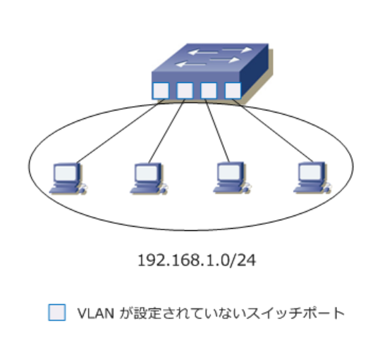
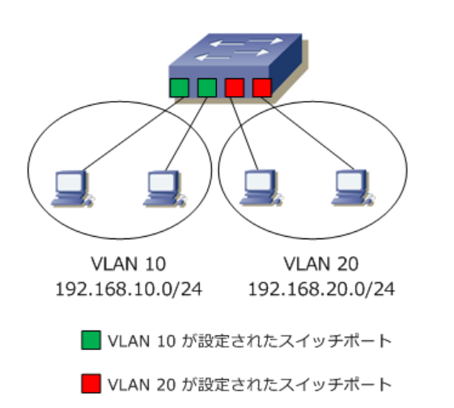
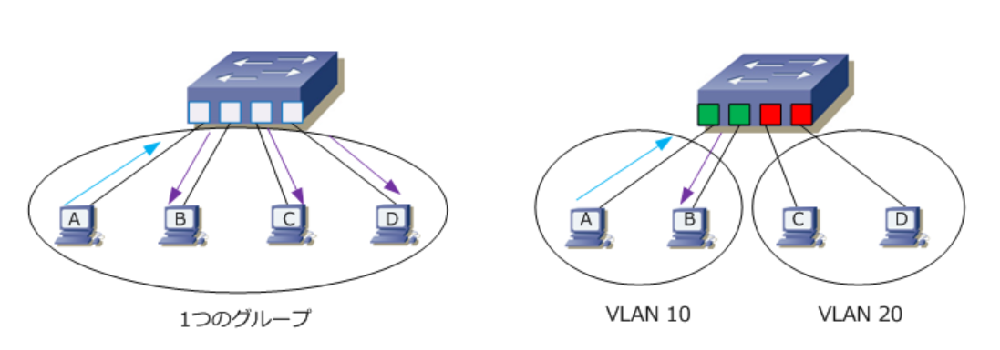
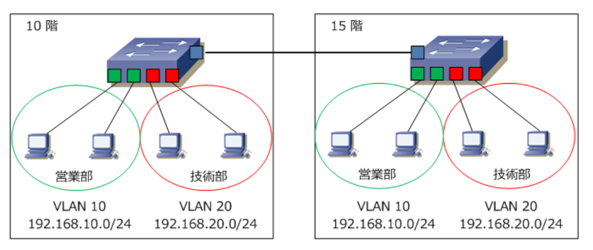
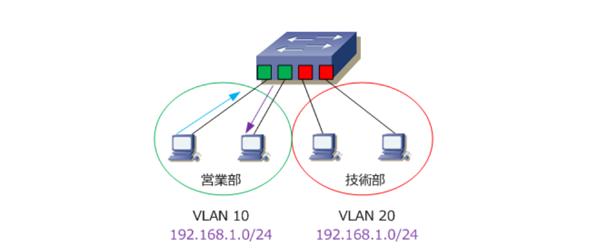
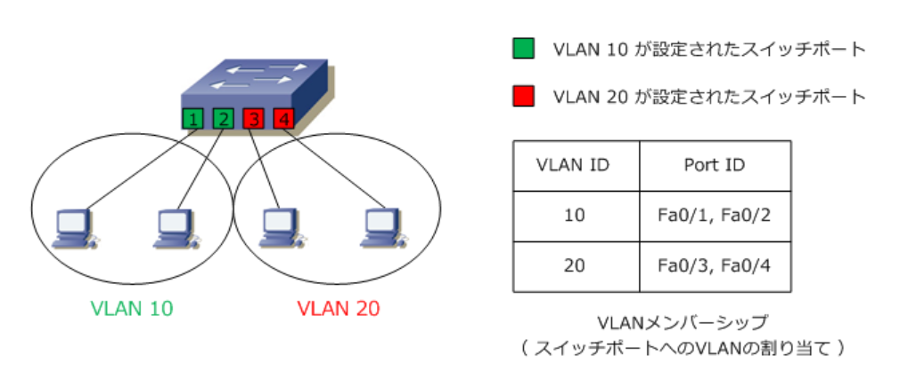
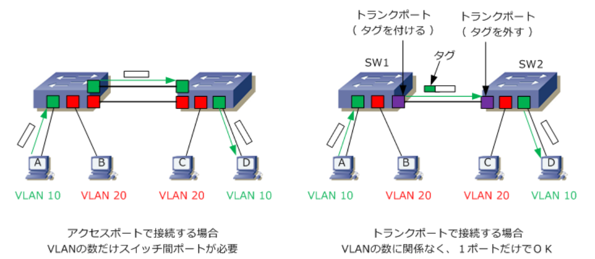
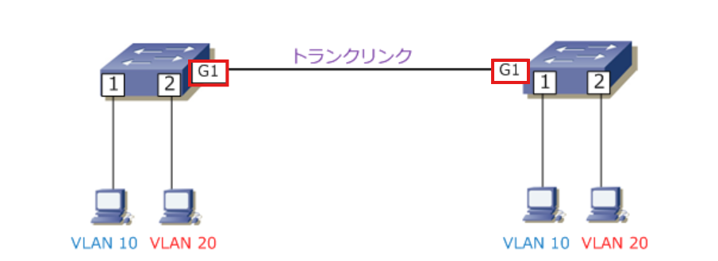
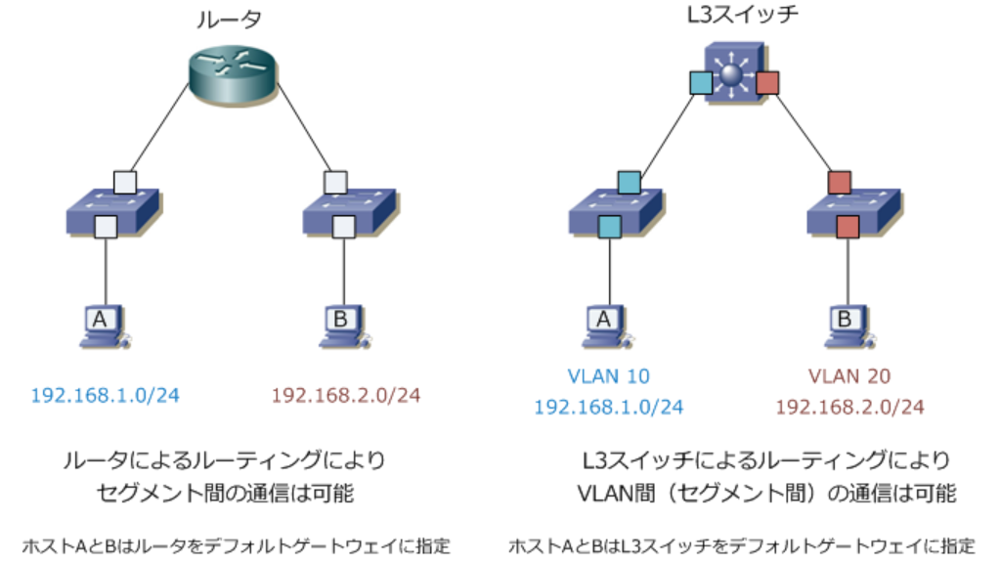

# VLAN

## VLAN概要解説
---

### VLANとは

VLAN（ Virtual LAN ）とは、物理的な接続形態とは独立して、仮想的なLANセグメントを作る技術です。  
VLANはスイッチ内部で論理的にLANセグメントを分割するために使用されます。  
VLANを使用することでルータやL3スイッチと同じようにL2スイッチでも**ブロードキャストドメインの分割**を行うことができます。

**VLANの概念のない１つのブロードキャストドメイン**



**VLANにより分割されたブロードキャストドメイン**



:::tip
スイッチのポートにVLANの識別番号となるVLAN IDを設定することで、番号ごとにブロードキャストドメインを分割できます。
:::

### VLANの特徴

1. **ブロードキャストドメインの分割**  
ホストAとBが通信するために、ホストAはARPリクエストをブロードキャストする必要があります。  
結果、左下図の通り、そのブロードキャストはホストBだけでなくC、Dも受け取ります。  
しかし、VLANによりブロードキャストドメインを分割することで、右下図の通り、ホストAからのブロードキャストはBだけが受信するようになり、無駄な受信フレームが減ることで、各ホストの無駄なCPU処理などを軽減できます。



2. **物理配置にとらわれないセグメント化**  
VLANは複数のスイッチにまたがり設定することが可能で、これにより異なるフロアーのスイッチ間の接続でもブロードキャストを分割できます。  
下図では、10F営業部からのトラフィックは、15F営業部だけに転送されて、10F技術部からのトラフィックは15F技術部だけに転送されます。  
また、部署変更や部署移動が発生してもスイッチポートに設定したVLAN IDを変更するだけで柔軟にセグメント化が可能です。



3. **セキュリティの向上**  
VLANを設定すると同じVLAN IDのポートにのみブロードキャストが転送され、異なるVLAN IDのポートに転送されません。  
下図ではVLAN10のスイッチポートに接続したホストとVLAN20に接続したホストに同じセグメント192.168.1.0/24のIPアドレスを設定しています。  
しかし、営業部からのPCのブロードキャストトラフィックは技術部には転送されないので、同じセグメントのIPアドレスでもVLAN IDが異なるので通信できません。  
このようにVLAN ID単位でトラフィックを分離することができるのでNWセキュリティが向上します。



### アクセスポートとトランクポート

VLAN機能のあるスイッチにはアクセスポートとトランクポートの2種類のポートがあります。  
アクセスポートは1つのVLANだけに所属するポートで、トランクポートは複数のVLANに所属するポートです。

### アクセスポート

アクセスポートは、1つのVLANだけに所属するポートです。  
通常、コンピュータなどのデバイスは1つのネットワークに所属するのでアクセスポートを使用します。
ここではスタティックVLANを紹介します。

#### スタティックVLAN
スタティックVLANは、スイッチポートに管理者が手動でVLANを割り当てる方法です。  
アクセスポートといえばこのスタティックVLANで設定することが一般的です。  
設定が簡単であるというメリットがあります。



### トランクポート

トランクポートは複数のVLANに所属するポートです。  
主にスイッチ同士を接続する際に使用するポートです。  

2台のスイッチに設定したVLANがまたがっている場合、例えば下図でホストA ⇔ D間、B ⇔ C間で通信させるためには2つの方法があります。  
1つは、スイッチ間を接続する専用のアクセスポートをVLANごとに作成してケーブル接続する方法（左下図）です。  
この方法では、VLANの数だけスイッチ間でポートが必要となります。



もう1つは、スイッチ間の接続ポートをトランクポートにして1本の物理リンクで複数のVLANトラフィックを伝送させる方法（右上図）です。  
トランクポートで接続したリンクのことを**トランクリンク**と呼びます。  

1本のトランクリンクに複数のVLANトラフィックを伝送しても、どのVLANトラフィックなのかを識別するためにトランクリンクでフレームを伝送する際にタグ（VLAN識別情報）を付けます。  
右上図でホストAからDへ送信したフレームはSW1のトランクポートでVLAN 10というタグが付加され、SW2のトランクポートでVLAN10というタグを読み取り、タグを外してVLAN10が割り当てられたポートにのみフレームを伝送します。

:::info
**トランキングプロトコル**

トランクリンクでVLANを識別するためにタグを付加するプロトコルには**IEEE802.1Q**と**ISL**の2つがあります。  
IEEE802.1Qは、標準化されているプロトコルで現在最も使用されているトランキングプロトコルです。
:::


## VLANコマンド解説
---

### VLANの作成

VLANの設定手順は、**VLANの作成** → **スイッチポートのモード設定**（ アクセスポートならVLAN IDの割当 ）  
といいう流れで実施します。

VLAN作成コマンドは以下の通りです。  
```bash
(config)# vlan vlan-id
(config-vlan)# name vlan-name
```

| コマンド引数 | 説明 |
|:---:|---|
| vlan-id | VLAN IDを1〜4094の範囲で指定。同時に複数作成したい場合は `,` や `-` を使用する。<br />`(config)# vlan 10` ← VLAN 10の作成<br />`(config)# vlan 10,20` ← VLAN 10とVLAN 20の作成<br />`(config)# vlan 10-20` ← VLAN 10〜VLAN 20まで11個のVLAN IDを作成 |
| vlan-name | VLANの名前を指定。VLAN名の設定は必須ではなくオプション。管理上の観点で設定する。<br />`(config)# vlan 10`<br />`(config-vlan)# name Sales` ← VLAN 10の名前をSalesと設定<br /><br />VLAN名を指定しない場合、自動的にVLAN番号の名前となる。VLAN 10の場合、VLAN0010。 |

### スイッチポートのモード設定

スイッチポートのモード設定コマンドは以下の通りです。
```bash
(config-if)# switchport mode [ access | trunk ]
```

| コマンド引数 | 説明 |
|:---:|---|
| access | スイッチポートをアクセスポートにしたい場合に指定 |
| trunk | スイッチポートをトランクポートにしたい場合に指定|

### アクセスポートの設定

アクセスポートの場合、スイッチポートのモードをアクセスにした後、そのポートにVLAN IDを割り当てます。

#### モード設定
```bash
(config-if)# switchport mode access
```

#### アクセスポートへVLAN IDを割り当てる設定

```bash
(config-if)# switchport access vlan vlan-id
```

| コマンド引数 | 説明 |
|:---:|---|
| vlan-id | VLAN IDを1〜4094の範囲で指定。<br />`(config-if)# switchport access vlan 10` ← VLAN 10をスイッチポートに割り当て |

### トランクポートの設定

トランクポートの場合、設定したいインターフェースを選択し、スイッチポートのモードをトランクにするだけです。  
コマンドは以下の通りです。
```bash
(config-if)# switchport mode trunk
```



:::caution
Catalystスイッチは機種によりトランキングプロトコルをIEEE802.1Qだけサポートしている機種、IEEE802.1QとISLの両方をサポートして
いる機種があります。  
両方のプロトコルをサポートしている機種ではトランクポートのモードを設定する前に最初にトランキングプロトコルを指定する必要があります。

**トランキングプロトコルの指定（ 機種に応じて設定が必要 ）**
```bash
(config-if)# switchport trunk encapsulation [ dot1q | isl ]
```
:::


#### allowed VLANの設定

allowed VLANとは、スイッチのトランクポートで、通過を許可するVLANを明示的に指定する設定のことです。  
これにより不要なVLANのトラフィックを遮断し、セキュリティを強化したりネットワークの効率を向上させたりする目的で使われます。

コマンドは以下の通りです。

```bash
(config-if)# switchport trunk allowed vlan vlan-id
```

| コマンド引数 | 説明 |
|---|---|
| vlan-id | トランクポートでの転送を許可するVLAN IDを指定。同時に複数作成したい場合は `,` や `-` を使用。<br />`(config-if)# switchport trunk allowed vlan 10` ← VLAN 10のトラフィックだけをトランクで許可<br />`(config-if)# switchport trunk allowed vlan 10,20` ← VLAN 10と20のトラフィックをトランクで許可<br />`(config-if)# switchport trunk allowed vlan 10-20` ← VLAN 10〜20のトラフィックをトランクで許可 |


## VLAN間ルーティング概要解説
---

L2スイッチはVLANでブロードキャストドメインを分割できます。  
しかし、L2スイッチはセグメント間のルーティングはできません（VLAN間ルーティングはできません）。  

VLAN間ルーティングにはL3スイッチ、ルータなどのルーティングのデバイスが必要となります。  
VLANを使用しないセグメント間ルーティングは左下図の構成となります。  
VLANを使用するVLAN間ルーティングでは、右下図の構成どおりL2スイッチとL3スイッチ間がアクセスポートなら同じVLAN IDにするかまたはトランクポートで接続する必要があります。



### L3スイッチとは
L3スイッチはL2スイッチング機能(VLAN分割)とL3ルーティング機能(VLAN間ルーティング)の両方を有しているので、機器単体でVLAN間を相互接続することができます。  

L3スイッチのスイッチポートに割り当てられているVLAN同士で通信を行うためには、各VLANがSVI(Switch Virtual Interface)という仮想的なインターフェイスを使用してL3スイッチの内部ルータと接続する必要があります。  

SVIにIPアドレスを割り当てて有効化することによって、内部ルータは直接接続されているネットワーク(L3スイッチで作成した各VLAN)をルーティングテーブルに登録します。  
このルーティングテーブルを基にルーティングを行うことで、L3スイッチ内部のVLAN間通信が可能になります。


## VLAN間ルーティングコマンド解説
---

### SVIの設定

マルチレイヤスイッチがVLAN間ルーティングするためには、SVI（Switch Virtual Interface）という論理インターフェースを設定する必要があります。  
このSVIはルーティングをさせたいVLANごとに作成する必要があります。  
該当するVLANを指定して、そのVLANに対してIPアドレスを割り当てれば完了です。

CatalystでSVIを作成するにあたり、まずはIPルーティングを有効化する必要があります。

**IPルーティングの有効化**
```bash
Catalyst(config) # ip routing
```

次に、SVIを以下の構文で作成します。  
SVI作成後は、そのインターフェースがshutdown状態にあるためそれを有効化させるため、`no shutdown` を入力してインターフェースを有効化させる必要があります。


**SVI の作成**
```bash
(config)# interface vlan vlan-id
(config-if)# ip address address mask
(config-if)# no shutdown
```


| コマンド引数 | 説明 |
|:---:|---|
| vlan-id | L3スイッチでVLAN間ルーティングさせたいVLANを指定<br />`(config)# interface vlan 10` |
| address mask | L3スイッチのSVIに割り当てたいIPアドレスとサブネットマスクを指定<br />`(config-if)# ip address 192.168.10.254 255.255.255.0` |

### 設定確認

設定完了後は `show ip interface brief` コマンドで「Status」と「Protocol」がともに up 状態であることを確認しましょう。  
SVI が正常に動作していない場合は以下の順番で SVI のステータスを確認していきましょう。


| SVIのステータス確認 | 説明 |
|---|---|
| show vlan | SVIが関連付けられたVLAN IDが存在しているかを確認 |
| show interfaces status | SVIで指定したVLANに関連付けられたポートがup/upであることを確認 |
| show ip interface brief | SVIに関連付けられたIPアドレス、Status、Protocolのup/up状態を確認 |
| show ip route | SVIに関連付けられたIPセグメントがdirectly connectedで存在するかを確認 |

