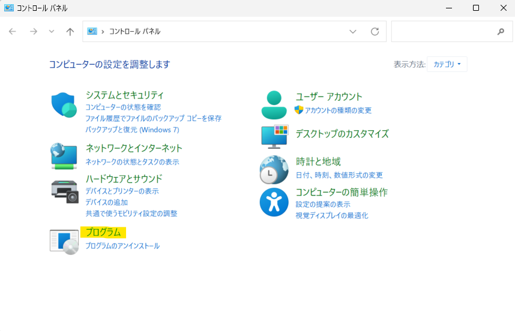
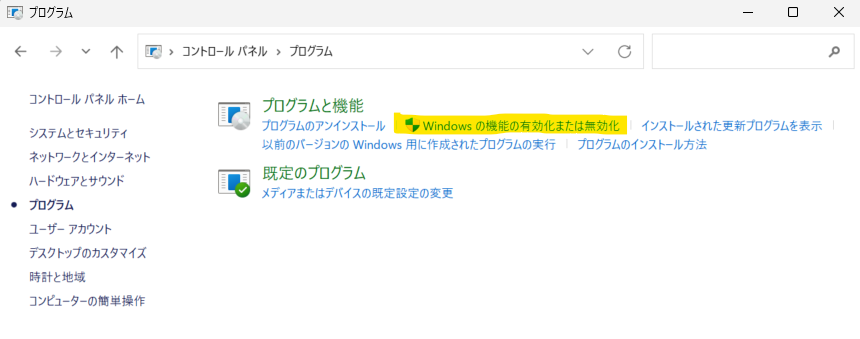
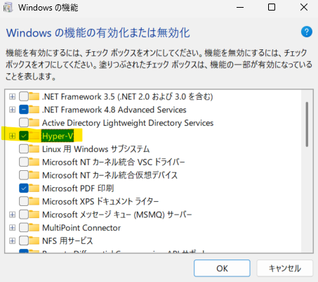
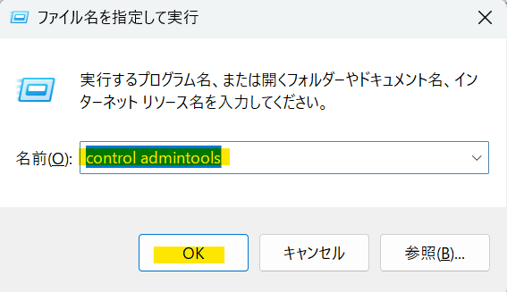
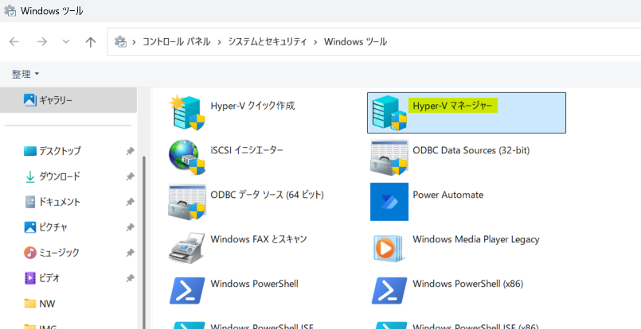
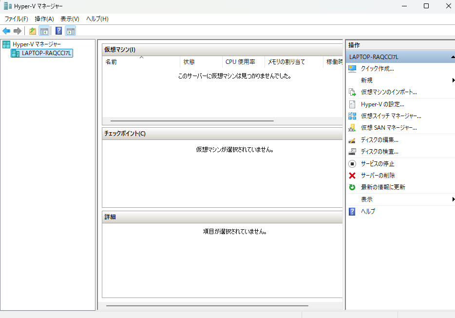

# Windows 11 に Hyper-Vをインストール

Hyper-V（読み方：ハイパーブイ）は仮想マシンを動かすための Windows の機能です。Hyper-V を使うと異なるオペレーティングシステムを Windows 上で動かすことができます。ここでは 18 歳の新入社員向けに Hyper-V のインストール方法を説明します。  

## Hyper-V のシステム要件
***
Hyper-V のシステム要件は以下の通りです。
|役割|説明|
|---|---|
|OS|Windows 8 以降の Pro、Enterprise、Education エディション|
|CPU|64ビットプロセッサ（Intel VT-x または AMD-V 対応）|
|メモリ|最低 4GB（推奨 8GB 以上）|
|ストレージ|十分な空き容量（SSD 推奨）|
|BIOS/UEFI|ハードウェア仮想化（VT-x/AMD-V）と DEP を有効化|
|設定|Windows の「機能の有効化または無効化」から Hyper-V を有効化|
:::note info
確認方法:
タスクマネージャーで仮想化の有効状態を確認  
-  Ctrl + Shift + Esc で タスクマネージャー を開く  
- 「パフォーマンス」タブ → 「CPU」を選択  
- 「仮想化」のステータスが 「有効」 になっていることを確認  
:::

## Hyper-V のインストール手順
***
### ① BIOS / UEFI の設定を確認（必要な場合）
   1. PC を再起動し、BIOS / UEFI 画面 を開く（起動時に F2 / F10 / Del キーなどを押す）  
   2. 「Intel VT-x」または「AMD-V」 を有効化  
   3. 「データ実行防止（DEP）」 を有効化  
   4. 設定を保存し、PC を再起動  

### ② Hyper-V の有効化
   1. 「Windowsキー＋R」で「ファイルを指定して実行」を表示します
   2. 入力欄に「control」と入力し「OK」をクリックしコントロールパネルを表示します
   3.  表示されたコントロールパネルの「プログラム」をクリックします

             

             

   4. 「プログラム」画面が表示されたら、「Windowsの機能の有効化または無効化」をクリックします。  
             
   5. Windows の機能が表示されたら、「Hyper-V」にチェックをつけ、「OK」をクリックします。  
             
   6. チェック後、PCの再起動を行います。

## Hyper-V GUI 管理ツールの起動手順
---
### Hyper-V マネージャーの起動
   1. 「Windowsキー＋R」で「ファイルを指定して実行」を表示します
   2. 入力欄に「control admintools」と入力し「OK」をクリックし「Windows ツール」を表示します
   3.  表示された「Windows ツール」の「Hyper-V マネージャー」をクリックします
   
           

            

   4.  Hyper-V マネージャーでは仮想マシンの作成や仮想ネットワークの構築を行うことができます。  

            

