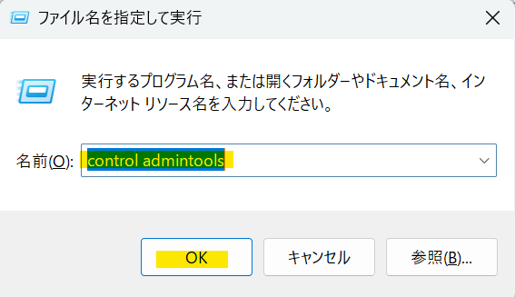
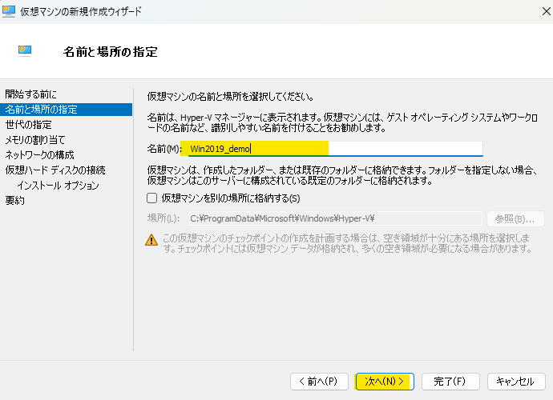
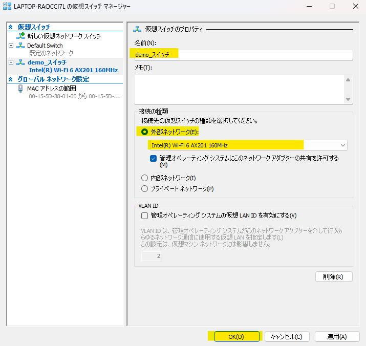

# Hyper-VにWindows2019をインストール

Hyper-V は、Windows の仮想化プラットフォームであり、仮想マシン (VM) を作成し、複数のオペレーティングシステムを実行できます。    
本記事では、Hyper-V 上に WindowsServer2019 をインストールする手順を詳しく解説します。

## 前提条件
***
以下の環境が整っていることを確認してください。

-  Windows 11 Pro または Enterprise を使用していること  
   ※ Home エディションでは Hyper-V を利用できません。  
-  Hyper-V が有効になっていること  

※以下要件以上のハードウェアリソースがあること。  
   |役割|説明|
   |---|---|
   |CPU|仮想化支援機能 (VT-x/AMD-V) が有効|
   |CPU| 8GB 以上 (推奨)|
   |メモリ|80GB 以上の空き容量|

## Windows Server 2019 評価版の入手
***
以下リンクをクリックしてWindows Server 2019（評価版）のiSOファイルをダウンロードしてください。  
※ダウンロードしたiSOファイルは開く事が出来ません。  
[Windows2019(評価版) ISOファイルダウンロード](https://go.microsoft.com/fwlink/p/?LinkID=2195167&clcid=0x411&culture=ja-jp&country=JP)

## Hyper-V マネージャーの起動
***
### 

   1. 「Windowsキー＋R」で「ファイルを指定して実行」を表示します
   2. 入力欄に「control admintools」と入力し「OK」をクリックし「Windows ツール」を表示します
   3.  表示された「Windows ツール」の「Hyper-V マネージャー」をクリックします
   
           

            

   4.  Hyper-V マネージャーでは仮想マシンの作成や仮想ネットワークの構築を行うことができます。  

            

## Hyper-V 仮想マシンの作成
***
Hyper-V を操作して、仮想マシンを作成します。

   1. 左ペインに、Hyper-Vサーバーのコンピューター名（図では LAPTOP-RAQCCI7L）を右クリックして、「新規」にマウスをポイントし、「仮想マシン」をクリックします。
               
   2. 仮想マシンの新規作成ウィザードでは、そのまま「次へ」をクリックします。
               
   3. 仮想マシンの名前を設定します。設定したら「次へ」をクリックします。  
      ※マシン名は任意です。本手順では「win2019_demo」としています。
               

   4. 第２世代 を選択し「次へ」をクリックします。
      
             

      :::note info
      仮想マシンの世代は「第1世代」と「第2世代」があり、今回は第2世代を選択します。第1世代は古いOSや32bit版向けでBIOSブート対応、一方で第2世代は64bit OS専用でUEFIブートに対応し、セキュアブートや高速化のメリットがあります。Windows Server 2019/2022を使用するため、第2世代が適しています。
      :::

   5. メモリの割り当てですが、起動メモリに4096と入力して「次へ」をクリックします。

             

   6.  ネットワークの構成では、「defaultSwitch」を選択して「次へ」をクリックします。  
       ※この後の手順で「内部仮想スイッチ」の作成と割当を行います。
   
                  

   7. この画面での変更は不要のため、内容を確認して、「次へ」をクリックします。

              

   8. 「ブートイメージファイルからオペレーディングシステムをインストールする」を選択して、「参照」をクリックします。  
       開いた画面でダウンロードした「WindowsServer2019」のiSOファイルを選択し「次へ」をクリックします。

             

   9.  画面右下の「仮想スイッチマネージャー」をクリックします。

             

   10.  画面左の「新しい仮想ネットワークスイッチ」を選択、  
   仮想スイッチの作成では「外部」を選択して「仮想スイッチの作成」をクリックします。
     
             

   11.  仮想スイッチの名前(任意)を入力します。  
   接続の種類では「外部ネットワーク」にチェックを入れ、ワイヤレス接続が可能なアダプタを選択し、「OK」をクリックします。
     
           

   12.  画面右下の「設定」をクリックします。
     
             

   13.  画面左下の「ネットワークアダプター」を先ほど作成した仮想スイッチにして「OK」をクリックします。  

             

:::caution
複数の仮想マシンを作成する場合、最初に作成した仮想スイッチを使い回して下さい。  
仮想マシンを作成する度に仮想スイッチを作成する必要はありません。
:::

## WindowsServer2019インストール
***

1. 仮想マシンの電源を起動して、OSのインストールを行います。  
        作成した仮想マシンを右クリックして、「接続」をクリックします。

           

2.  表示された画面中央の「起動」をクリックし、仮想マシンの電源をONにします。  
    ※電源をONにするとセットされたISOイメージファイル(仮想的なDVD)の読み込みが行われますが、
   **5秒程度以内になにかしらキーを入力しないとエラーになってしまいます。**

           

3.  少し待つと言語選択の画面が表示されますので、「日本語」になっている事を確認して「次へ」をクリックします。
         

4.  表示された画面で「今すぐインストール」をクリックします。

         

   

5.  次の画面では、「Windows Server2019 DataCenter Evolution(デスクトップエクスペリエンス)」を選択し「次へ」をクリックします。  
※「 デスクトップエクスペリエンス」が付いていない物を選択するとコマンドベースのOS (Server Core) がインストールされます。

         

6.  ライセンス条項を確認したら「同意します」にチェックを入れて、「次へ」をクリックします。

         

7.  「カスタム:Windowsのみをインストールする(詳細設定)」を選択します。

         

8.  そのまま「次へ」をクリックしてください。

         

9.  Windowsの インストールが始まりますので完了するまでしばらく待ちます。

         

10.  管理者 (Administrator) のパスワードを設定します。本研修では「P@ssw0rdd_」と設定して「完了」をクリックします。

         

11.  ログイン画面が表示されたらインストールは完了です。先ほど設定したパスワードを入力してログインしましょう。

         

