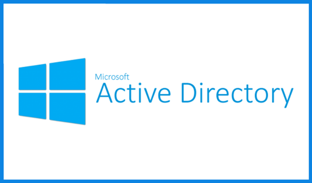
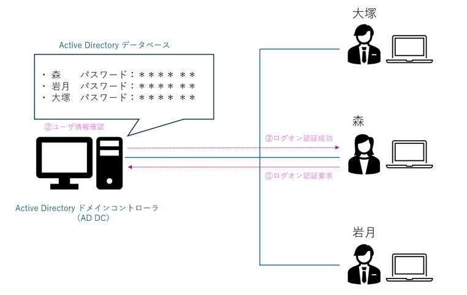
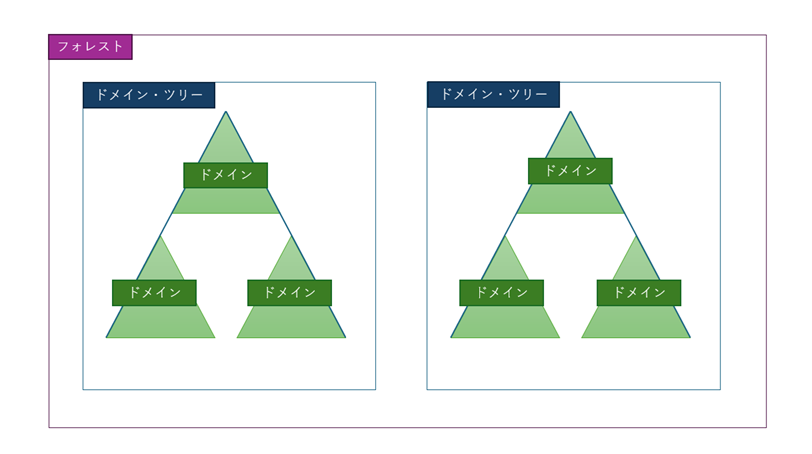
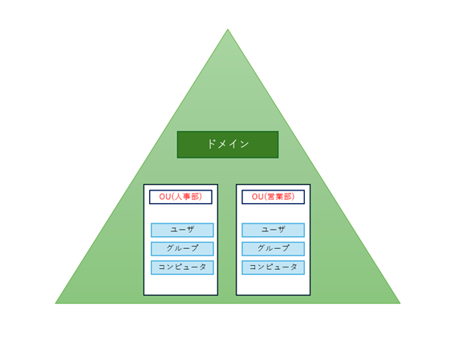

# Active Directoryとは  
---
Active Directory（アクティブディレクトリ、以下AD）は、Microsoftが提供するディレクトリサービスです。  
主にWindows Server上で動作し、企業や団体の中で、ユーザーアカウントやコンピューター、プリンタ、共有フォルダなど、様々なネットワーク資源を一元的に管理する役割を担います。
なお、ディレクトリサービスというのは、あらゆる「情報の所在」を記録し、検索できる仕組みのことです。  
ADは、企業における「人・モノ・ルール」の関係性を整理し、それぞれに適切なアクセス制御を行う基盤として機能しています。

 

## Active Directoryでできること
---
Active Directory（AD）は、単に「ユーザー情報をまとめるだけの仕組み」ではありません。  
ADが導入されている企業では、**社員がPCを立ち上げてから仕事を始めるまでの一連の動作**が、すべてADを通じて支えられています。  

### 1. ユーザーとコンピューターの一元管理

新しい社員が入社するたびに、アカウントをいちいち各PCに作成し、パスワード設定やアクセス権を個別に設定していたらどうなるでしょうか？  
時間も手間もかかりますし、設定ミスのリスクも高くなります。ADを使えば、管理者は**ドメインコントローラー上で一度アカウントを作成するだけ**で、ネットワーク上の全PCから同じユーザー名とパスワードでログインできるようになります。PCの初期設定もテンプレート化できるため、新入社員のIT環境準備はほんの数分で完了します。

> 例：アカウント「大塚、森、岩月」をADに登録すると、本人はその日から社内のどのPCからでも自分のデスクトップ環境にログインできるようになります。

 

### 2. アクセス権限の集中管理と自動化

「誰が、どのフォルダにアクセスできるか」を個別に設定していたら、設定漏れや情報漏えいが起こりかねません。  
ADでは、あらかじめ「営業部フォルダは営業部グループのみアクセス可」などのルールを設定し、ユーザーをグループに追加するだけで権限が適用されます。これにより、**情報の守るべき範囲が明確化され、属人的な運用も減らせます。**

> 例：開発部のソースコードが格納されたフォルダは「DevTeam」グループのみに閲覧許可。人事部のPCからはアクセス自体ができません。

### 3. セキュリティポリシーの統一と強制適用（GPO）

社内のPCに「スクリーンセーバーを10分で起動する」「USBの使用を禁止する」「勝手にアプリをインストールできないようにする」といったセキュリティ対策は必要不可欠です。
こうした設定を、個別のPCに手作業で行っていたら非効率なうえに、設定漏れや不正な変更の恐れもあります。ADでは、**GPO（グループポリシーオブジェクト）**を使って、すべてのPCに一括でポリシーを配布し、管理者が定めたルール通りに強制的に適用できます。

> 例：社内のPCはすべて、夜10時以降はログインできないように設定。労働時間の制限と情報漏えいリスクを同時に防止。

### 4. ソフトウェアの配布・バージョン管理

社員のPCにインストールすべきソフトウェアがある場合、インストール作業を手作業で行うのは現実的ではありません。  
ADを使えば、特定のグループに所属するPCに対して、**特定のアプリケーションを自動配布・インストール**することができます。
また、更新もAD経由で集中管理できるため、古いバージョンが放置されるといったリスクも低減できます。

> 例：営業部には名刺管理ソフト、人事部には給与計算ソフトを自動配布。それぞれの業務に必要なツールを部署単位で管理。

### 5. シングルサインオン（SSO）の実現

ADによって認証されたユーザーは、Windowsへのログインだけでなく、メール、ファイルサーバー、社内ポータルなど、**複数のサービスに再ログインすることなくアクセス**できます。  
この仕組みは**シングルサインオン（SSO）**と呼ばれ、日々の業務をスムーズに進めるうえで非常に有効です。

> 例：朝PCを起動してログインすれば、メール、予定表、共有フォルダ、勤怠システムにすべて自動で入れるようになる。

### 6. ログ管理・監査対応

ADはユーザーのログオン履歴、操作履歴、ポリシー違反の痕跡などを記録することができ、これにより**万が一の不正アクセスや情報漏えいの調査が可能**になります。

IT統制やISMS、Pマークといったセキュリティ認証の取得や維持の場面でも、ADによるログ監視と監査体制は重要な要素です。

> 例：ある機密ファイルが流出した際、ADのログをもとに「誰が」「いつ」「どのPCから」アクセスしたかを特定できる。

## Active Directoryを構成する要素
---
ADの構造は階層的で、次のような要素によって構成されています。

### 1. ドメイン（Domain）

Active Directory（AD）における「ドメイン」とは、ユーザーやコンピューター、グループなどの“オブジェクト”をまとめて管理するための **基本的な枠組み（境界）** です。

たとえば、会社全体を1つの「ドメイン」として定義した場合、その中にすべての社員アカウントや社内PCが登録され、管理されることになります。  
このドメインを単位として、ログイン時の認証処理や、ポリシーの適用、権限管理などが行われます。

> ✔ ポイント  
> ドメインに属しているユーザーは、どの社内PCからでも自分のアカウントでログインでき、社内共有フォルダなどにアクセスできるようになります。

また、会社が複数の事業を展開している場合には、事業ごとにドメインを分けるケースもあります。そうした複数のドメインをまとめる上位の仕組みが「フォレスト（Forest）」ですが、通常の中小規模の企業ではドメイン1つで十分な運用が可能です。

 

### 2. 組織単位（OU：Organizational Unit）

OU（組織単位）は、ドメインの中でさらに情報を**階層的に分けて管理するための単位**です。  
イメージとしては、ドメイン全体が「会社の本体」だとすれば、OUは「部署やチームの区切り」のようなものです。

たとえば、「営業部」「人事部」「開発部」といったOUを作成することで、それぞれの部門に所属するユーザーやPCを分けて整理できます。

このOUごとに異なる管理者を設定したり、専用のポリシー（GPO）を適用したりできるため、**組織の実態に沿った柔軟なIT管理**が可能になります。

> ✔ 例  
> - 営業部のOUには、外出先からのアクセスを許可するポリシーを適用  
> - 開発部のOUには、USBメモリ使用禁止のポリシーを設定

OUは、あくまで「分類と管理のための枠組み」であり、OU自体に直接アクセス権を設定することはありません。アクセス制御は、次に紹介する「グループ」などを通じて行います。

 

### 3. グループ（Group）

ADにおける「グループ」とは、複数のユーザーやコンピューターをまとめて1つの単位として扱えるようにする仕組みです。  
グループを活用することで、個別にユーザーごと設定をするのではなく、**まとめてアクセス権限やポリシーを付与**できるようになります。

たとえば、「営業共有フォルダ」へのアクセス権を設定する際、営業社員一人ひとりに権限を与えるのは大変です。代わりに「営業部グループ」を作成し、フォルダにはそのグループに対して権限を与えておけば、あとは営業社員をそのグループに追加するだけで済みます。

> ✔ よく使われるグループの活用例  
> - 「HR」グループ → 人事システムにアクセス可能  
> - 「DevTeam」グループ → ソースコードリポジトリにアクセス可能  
> - 「AllUsers」グループ → 全社員が使うアプリのインストール対象

グループは「セキュリティグループ」と「配布グループ」の2種類がありますが、アクセス権限などを設定する目的では**セキュリティグループ**を使用します。

### 4. GPO（Group Policy Object）

GPO（グループポリシーオブジェクト）は、ユーザーやコンピューターに対して**動作のルールを一括して適用する仕組み**です。

これにより、企業内のPC全体に共通のセキュリティ設定を加えたり、特定のソフトウェアを配布したり、ユーザーの操作を制限したりすることができます。

> ✔ 代表的なGPOの設定例  
> - 10分間操作しなかったら自動的に画面ロック  
> - 指定フォントでWordを開く  
> - Windowsの設定画面をユーザーが開けないようにする  
> - 毎週水曜の朝5時にWindows Updateを実行させる

GPOはドメイン全体に適用することもできますし、OU単位で個別に設定することも可能です。  
たとえば、一般社員用のPCでは操作を制限し、開発部のPCでは柔軟にソフトウェアをインストールできるようにするなど、**部門や業務内容に応じたIT環境の作り分け**ができます。

GPOの設定には注意も必要で、優先順位や継承関係によっては想定外の挙動になることもあります。AD管理者は、常にGPOの適用範囲を確認しながら運用していくことが求められます。

