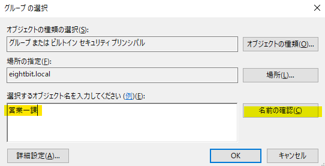

# Active Directory演習

このページでは**Active Directory Domain Service**(以降ADDS)の主要な機能を紹介しています。  
記載されている手順を参考に、実際に手を動かして理解を深めましょう。  

    
1. ADインストール

    

まずは構築したWindows ServerにADDSの機能サーバーマネージャーを起動し、`管理` から` 役割と機能の追加` をクリックしてください。

役割と機能の追加をする際の注意の画面が出てきます。  
確認したら `次へ` をクリック。  

:::caution
インストール作業を開始する前に、以下を確認してください。  
- IPアドレスが固定されていること(DHCPではなくスタティックで設定)
- WindowsUpdateが実行されていること
:::

`役割ベースまたは機能ベースのインストール`がチェックされていることを確認し、`次へ` をクリック。  

インストールするサーバを選択する画面です。  
操作中のサーバにインストールするので、サーバープールから該当端末を選択して `次へ` をクリック。  

インストールする役割を選択します。  
画面中央の `Active Directory ドメインサービス` の左部分のチェックボックスをクリック。

確認画面が表示されるので、`機能の追加` をクリック。

画面中央の `Active Directory ドメインサービス` の左部分のチェックボックスに、チェックが入っていることを確認し、`次へ` をクリック。  

特に操作せず `次へ` をクリック。  

特に操作せず `次へ` をクリック。  

以下画像と同じ様に表示されていることを確認し、`インストール` をクリック。

インストール完了後、画面中央に `このサーバーをドメインコントローラーに昇格する` というリンクが表示されるので、これをクリック。

:::tip
ADDS（Active Directory Domain Services）におけるドメインコントローラー（DC）は、ユーザーやコンピューターなどの情報（アカウント）を一元管理し、認証を行うサーバーです。  

簡単に言うと、「誰が」「どのコンピューターで」「何ができるか」 を管理する、ネットワークの中心的な存在です。  
DCがないと、ネットワークに参加するたびに個別の設定が必要になり、セキュリティも低下します。

今回は研修ですのでシングルドメインコントローラー構成で進行しますが、以下の特性を知識として持っておきましょう。  

ドメインコントローラーが故障した場合
- ドメイン全体の認証
- グループポリシーの適用
- SYSVOLへのアクセス 

などが完全に停止してしまいます。  
これは、業務継続に深刻な影響を与えます。

また全ての認証要求や管理操作が1台のサーバーに集中するため、  
負荷が高くなり、パフォーマンスの低下を招く可能性があります。  
特にユーザー数やコンピューター数が増加すると顕著になります。

上記のように、シングルドメインコントローラー環境は、可用性、パフォーマンス、信頼性の他、セキュリティの観点からも一般的には**推奨されません**。
:::

`新しいフォレストを追加する` がチェックされていることを確認し、`ルートドメイン名` を **eightbit.local** に設定します。  
入力が完了したら `次へ` をクリック。  

:::tip

フォレストとは、ADDSにおける最も大きな管理単位です。  
ルートドメインとは、フォレスト内で最初に作成される特別なドメインで、フォレストの作成時に必ず1つだけ存在し、フォレスト全体の基礎となります。

:::

`フォレストの機能レベル` はそのままで、`ディレクトリ復元モードのパスワード` は **P@ssw0rdd_** を入力してください。  
入力が完了したら `次へ` をクリック。  

:::tip
フォレストの機能レベルとは、フォレスト全体で利用できるAD DSの機能の範囲を示すものです。  
わかりやすく例えるなら、フォレスト全体のAD DSの「バージョン」 のようなものです。  

機能レベルを上げると、新しいバージョンのWindows Serverで導入された高度な機能がフォレスト全体で利用できるようになります。  
フォレストの機能レベルは、フォレスト内のすべてのドメインコントローラーが満たす必要のある最低限のWindows Serverのバージョンを決定します。  

例えば、フォレスト機能レベルが「Windows Server 2016」の場合、フォレスト内のすべてのドメインコントローラーはWindows Server 2016以上である必要があります。  
上記の場合、古いバージョンのドメインコントローラーはフォレストに参加できなくなるので注意が必要です。

:::

特に操作せず `次へ` をクリック。 

黄色ハイライト箇所は自動的に入力されます。  
特に操作せず `次へ` をクリック。 

:::tip
NetBIOSドメイン名は、昔ながらのWindowsネットワークで使われていた短い識別名です。  
現代のネットワークではDNSドメイン名が主流ですが、互換性のためにNetBIOSドメイン名も依然として存在することがあります。  
DNSドメイン名がインターネット全体で使われるグローバルな名前であるのに対し、NetBIOSドメイン名は主にローカルネットワーク内で機能します。

例えば、DNSドメイン名が example.com の場合、NetBIOSドメイン名は EXAMPLE のようになることが多いです。（すべて大文字で表現されるのが一般的です）
:::

AD DSの各種ファイルの保存先を設定する画面です。  
デフォルトのまま、`次へ` をクリック。 

:::tip
SYSVOLは、Active Directoryドメインにおける共有設定情報の中央保管場所であり、すべてのドメインコントローラー間で自動的に同期される、非常に重要な仕組みです。  
グループポリシーやスクリプトなどを一元管理し、ドメイン全体の整合性を保つ役割を担っています。  

SYSVOLが正常に機能していないと、以下のような問題が発生する可能性があります。

- グループポリシーがクライアントコンピューターに適用されない
- ログオンスクリプトなどが実行されない
- ドメインへのログオンに失敗する
:::

設定項目の確認画面が表示されます。  
確認できたら `次へ` をクリック。 

インストールするための前提条件がチェックされます。  
チェックが完了すると `インストール` が活性化するのでクリック。 
以上でAD DSのインストールは完了です。

サーバーマネージャーの役割とサーバーグループ欄に、`AD DS` と `DNS` が表示されていれば正常に完了しています。

    
2. OU(組織単位)作成

    

サーバーマネージャーを起動し、`ツール` から`Active Directory 管理センター` をクリックしてください。

左ペインのドメイン(eightbit)を右クリック > `新規` > `組織単位` をクリック。

組織単位の作成画面が立ち上がるので、名前欄に `Sales` と入力し、`OK` をクリック。

管理センター画面で **Sales** という名前のOUが作成されていることを確認しましょう。

    
3. ユーザオブジェクト作成

    

Active Directory管理センター を開き、作成したOU(今回はSales)を右クリック > `新規` > `ユーザー` をクリック。

ユーザーの作成画面が開くので、黄色い箇所を画像と同じように入力します。  
パスワードは `P@ssw0rdd_` と入力してください。  
完了したら `OK` をクリック。

Active Directory管理センターで作成ユーザが表示されていることを確認してください。

同じ要領でもう一つユーザオブジェクトを作成します。  
先ほどと同様に画像と同じように入力します。  
パスワードは `P@ssw0rdd_` と入力してください。  
完了したら `OK` をクリック。

    
4. グループオブジェクト作成

    

Active Directory管理センター画面を開き、左ペインのOU(今回はSales)をクリックし、右クリック > `新規` > `グループ` をクリック。

ユーザーの作成画面が開くので、黄色い箇所を画像と同じように入力します。  
入力が完了したら、管理者エリアの `編集` ボタンをクリック。

この画面では作成するグループの管理者を決定します。  
選択するオブジェクト名のテキストエリアに「sales」と入力し、`名前の確認` をクリック。

営業部管理者のオブジェクトが表示されることを確認し、`OK` をクリック。

管理者欄に選択したオブジェクト名が表示されていることを確認し、`OK` をクリック。

グループが作成できたので、次は特定のユーザオブジェクトをグループに追加します。
作成したユーザオブジェクトを右クリック > `グループに追加` をクリック。

選択するオブジェクト名のテキストエリアに「営業一課」と入力し、`名前の確認` をクリック。

管理者欄に選択したオブジェクト名が表示されていることを確認し、`OK` をクリック。

先ほどのユーザオブジェクトがグループに追加されていることを確認するため、ユーザのプロパティを開いてください。

所属するグループエリアに先ほどの設定が反映されていることを確認しましょう。

    
5. オブジェクト制御委任

    

サーバーマネージャーを起動し、`ツール` から`Active Directory ユーザーとコンピューター` をクリックしてください。

左ペインのドメイン(`eightbit.local`) > OU(`Sales`)を右クリックし、 `制御の委任` をクリック。

オブジェクト制御の委任ウィザード画面が表示されるので、`次へ` をクリック。

`追加` をクリック。

選択するオブジェクト名のテキストエリアに「営業部」と入力し、`名前の確認` をクリック。

選択したオブジェクト名(営業部管理者)が表示されていることを確認し、`OK` をクリック。

画像と同じように選択したオブジェクトが表示されていることを確認し、`次へ` をクリック。

委任するタスク画面では、`ユーザーアカウントの作成、削除、および管理` にチェックを入れて `次へ` をクリック。

内容を確認し、`完了` をクリック。
以上で制御の委任は完了です。

    
オブジェクトの監査

    

    
ダイナミックアクセス制御

    

    
グループポリシー

    

